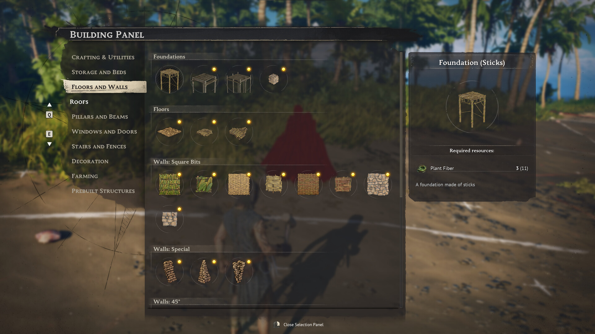

# 建築概要

> 情報源: [Steam ストアページ](https://store.steampowered.com/app/3041230/Windrose/)

Windroseの建築システムでは、素材を使って自由に拠点を建設できます。簡易シェルターから豪邸・要塞まで、複数の建築スタイルが用意されています。

## 建築の基本

- 素材を収集して建造物を設置する
- 設置した建造物は**解体すると素材が全て返却される**（試行錯誤が可能）
- NPCを勧誘することで拠点機能を拡張できる

## 各サブページ

| ページ | 内容 |
|--------|------|
| [建築スタイル](styles.md) | 利用可能なスタイルの外観と素材要件 |
| [建造物一覧](structures.md) | 壁・床・屋根・家具・防衛設備などのカタログ |

## 建築の流れ

1. 素材（木材・石材など）を収集
2. 最初の拠点として簡易シェルターを建てる
3. クラフトステーションを設置して生産力を確保
4. 素材が揃ってきたら拠点を拡張・強化する

---

## 重要な拠点仕様

### Comfort（快適度）の仕組み

Bonfire 近くのデコレーションが Rested バフの持続時間を伸ばす。ポイントは**「量」ではなく「種類」**。

- **サブカテゴリごとに +1**（同じ種類を複数置いても +1 のまま）
- **例**: 椅子×5 は +1、椅子×1 + テーブル×1 + ランプ×1 = +3
- **トロフィー（動物の頭部）のみ例外**: 固有種ごとに +1、最大 **+12** まで積み重なる
- 快適度レベルが上がるごとに Rested の持続時間が延び、**最大 30 分**

> Rested バフはスタミナ回復速度と最大量を大幅に底上げする。拠点帰還後は必ず取得してから出発すること。

### 屋根の要/不要はステーションによって固定

| 屋根 **必須** | 屋根 **不可（屋外設置専用）** |
|-------------|---------------------------|
| Armor Workbench | Charcoal Kiln（炭焼き窯） |
| Weaponsmith Workshop | Smelting Furnace（製錬炉） |
| Alchemy Table | Large Smelting Furnace |
| Enchanting Table | Jewelry Table |
| Millstone / Spinning Wheel | |
| Tanning Rig | |
| Shipwright's Workshop | |

屋根必須のステーションは**完全な密閉が不要**。頭上に屋根パーツがあれば壁なしでも機能する。

### 1つのアドオンで全 Workbench を強化

**Sawhorse（大工台アドオン）を1個設置するだけで、Bonfire 範囲内の全 Workbench が Lv2 になる**。Workbench ごとに個別購入は不要。Workbench に隣接した位置に設置すること。

### Bonfire が消えると全クラフトステーションが停止

Bonfire の薪が尽きると、その暖気範囲内の**全クラフトステーションが機能停止する**（Workbench のみ例外で単独動作可能）。長期間拠点を離れる前に薪の補充を確認すること。

### 倒した木が建造物にダメージを与える

伐採時に倒れた木が近くの建造物にぶつかって**ダメージを与える**。拠点周辺での伐採は倒れる方向を確認してから行うこと。
