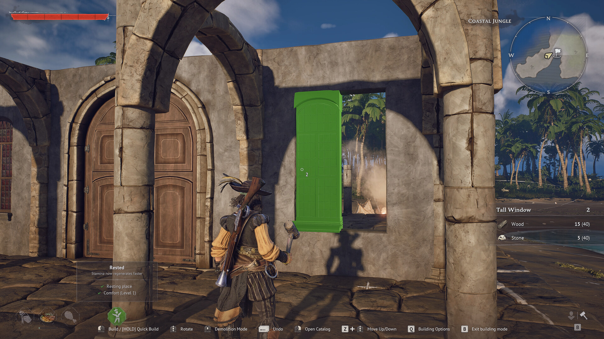

# 建築スタイル

> 情報源: [Steam ストアページ](https://store.steampowered.com/app/3041230/Windrose/) / [Fextralife Windrose Wiki: Buildings](https://windrose.wiki.fextralife.com/Buildings) / [Steam: Windrose Summarized Information](https://steamcommunity.com/sharedfiles/filedetails/?id=3704443626)

Windrose では複数の**建築スタイル（マテリアルセット）** が提供されており、同じ壁・床・屋根でも見た目と材料コストの異なるスタイルから選んで建造できます。壁1枚あたり**最大12種類のマテリアルスタイル**から選択可能で、対応する設計図（プラン）を解放することで使えるようになります。

## マテリアルティアの全体像

スタイルは大きく**4つのティア**に分類され、序盤の使い捨てシェルターから終盤の常設要塞まで段階的にアンロックされます。

| ティア | 例 | 用途 | 入手 |
|--------|-----|------|------|
| 初期（即席シェルター） | 植物繊維（Plant Fiber）、葉、枝、樹皮（Bark） | 序盤のチュートリアル島・最初の野営地 | 初期解放済み |
| 中位 | 板材（Plank）、粘土（Clay）、石（Stone） | 通常の家屋・最初の常設拠点 | 設計図ドロップ / 商人購入 |
| 上位 | 石と木材（Stone and Timber） | 中盤の本拠地・襲撃対策 | POI（Point of Interest）の宝箱 / 派閥商人 |
| 終盤（エステート） | マホガニー（Mahogany）、石灰岩（Limestone）、大理石（Marble） | 豪邸・要塞 | 終盤のレア設計図 / 派閥商人 |

> ⚠️ ティア区分・HP 値は Fextralife wiki および Steam コミュニティガイド由来の暫定情報です。実機 UI 表示と差異がある可能性があり、随時更新します。

## 解放の仕組み

### 設計図の入手経路

新しい建築スタイルは以下の方法で解放されます：

1. **派閥商人（Faction Vendors）からの購入** — トルトゥーガや各島の派閥拠点で販売。商人で売っている設計図は宝箱のランダムプールには含まれないため、欲しいスタイルは商人から直接買うのが確実
2. **POI（Point of Interest）の宝箱** — 廃墟・遺跡・敵キャンプの宝箱からドロップ
3. **島の探索** — 島ごとに固有の建築設計図が存在

### トルトゥーガの密輸業者バンドル

中盤の有力な近道として、**トルトゥーガ（Tortuga）の密輸業者ベンダー（Smugglers Vendor）が「石と木材」建築パック**を販売しています。**10ギニー（Guinea）** で購入でき、解放されると **2×2 の石製基礎を石1個で設置**できるようになる、コストパフォーマンスの非常に良いパックです。

## 主な建築スタイル

### 植物繊維（Plant Fiber）/ 葉・枝
最序盤の即席素材。コストはほぼゼロですが、敵の襲撃には全く耐えられません。チュートリアル島の野営地用と割り切るのが基本です。

### 樹皮（Bark）/ 枝（Stick）
チュートリアル島を出る前から使える基本セット。Plank・Stone・Stone and Timber などに後から作り直すときも**材料を失わない**仕様のため、初期拠点を樹皮や板材で建てても無駄にはなりません。

### 板材（Plank）
木材を加工した中位の建築セット。クラフトコストが低めで、序盤〜中盤の通常家屋の主力。

### 粘土（Clay）
板材と並ぶ中位スタイル。粘土を主材料とし、コミュニティの報告では中位の壁は HP 約 1,500 で、通常の盗賊襲撃を耐えるレベル。

### 石（Stone）
本格的な常設拠点向け。トルトゥーガの密輸業者バンドルで一気にアンロックできるのが効率的。

### 石と木材（Stone and Timber）
石と木材を組み合わせた上位スタイル。終盤のエステート系よりは入手しやすく、見た目と防御性のバランスが良い選択肢。

### マホガニー（Mahogany）
高級木材を使った終盤スタイル。装飾性が高く、屋敷・豪邸の見た目作りに使われます。**ハードウッド（Hardwood）** の大量投資が必要。

### 石灰岩（Limestone）/ 大理石（Marble）
終盤の最高ティア。**設計図は POI の宝箱や上位派閥商人のレアドロップ**でしか入手できず、要塞・豪邸の最終仕上げ向け。石・粘土の大量備蓄が前提となります。

## 既存建築からの作り直し

Plant Fiber や Bark などの初期スタイルで建てた建築は、**後からより上位のスタイルに作り直しても材料は失われません**（再建時のコストとして再利用される報告あり）。そのため序盤は躊躇なく粗末な素材で拠点を作り、ティアが上がってから建て直す運用が推奨されます。

## 建築規模の例

Steam ストアページで言及されている建築規模：
- 簡易シェルター（基本的な雨風をしのぐ構造） — Plant Fiber / Bark
- 通常の家屋 — Plank / Clay / Stone
- 豪邸 — Mahogany / Limestone
- 要塞 — Stone and Timber / Marble

スタイルの組み合わせは自由で、構造部分は石で防御性を取り、内装は木材で温かみを出すといった**混在運用**も可能です。

## パッチによる建築改善

2026-04-30 パッチ（0.10.0.4.268）で建築パーツが大幅に拡充されました：
- 屋根角度対応の**壁三角ピース約40種類**を追加
- **床三角ピース3種類**を追加
- **プランター（苗床）4種類**を追加
- 各建築セットで**部品の製作コストを大幅削減**

詳細は[パッチノート](../patch-notes.md)を参照してください。

---

## 注意事項

- 上記のスタイル名・ティア区分は Fextralife wiki および Steam コミュニティガイドに基づく現時点の整理です
- 公式日本語ローカライズで確認できていないスタイル名は仮訳（英名併記）としています
- 各スタイルの**正確な必要素材数・HP 値・解放条件**は実機検証中の項目があり、判明次第更新します
- 解放系の挙動（商人売り設計図が宝箱に出ない等）はコミュニティの観察に基づく報告で、今後のアップデートで変わる可能性があります

## 情報源

- [Steam ストアページ](https://store.steampowered.com/app/3041230/Windrose/)
- [Fextralife Windrose Wiki: Buildings](https://windrose.wiki.fextralife.com/Buildings)
- [Steam: Windrose Summarized Information](https://steamcommunity.com/sharedfiles/filedetails/?id=3704443626)
- [Steam Discussion: Is paying the only way to unlock stone and wood buildings?](https://steamcommunity.com/app/3041230/discussions/0/802345327968494263/)
- [Steam Discussion: New building blocks](https://steamcommunity.com/app/3041230/discussions/0/802344996812452784/)
