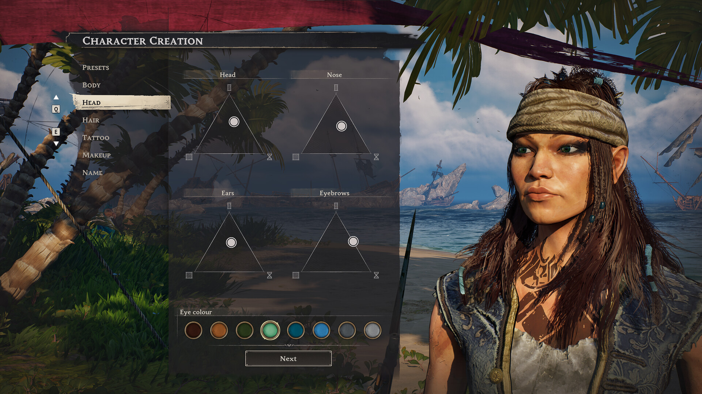

# キャラクター概要

> 情報源: [Steam ストアページ](https://store.steampowered.com/app/3041230/Windrose/) / [Steam コミュニティ ビギナーズガイド](https://steamcommunity.com/app/3041230/discussions/0/757304565299215807/)

Windroseにはクラスシステムはありません。代わりに**ステータス振り**・**タレント（Talent）ツリー**・**装備のロードアウト**の組み合わせでキャラクターをカスタマイズします。

## 各サブページ

| ページ | 内容 |
|--------|------|
| [ステータス](stats.md) | 各ステータスの効果と振り方 |
| [タレント](talents.md) | タレントツリーの仕組みとおすすめタレント |
| [ビルド集](builds.md) | 近接・遠距離・混合などのビルド例 |
| [食事・ポーション](buffs.md) | バフ効果一覧とおすすめの組み合わせ |

## キャラクター育成の流れ

1. レベルアップでステータスポイントとタレントポイントを獲得
2. ステータスに振り分けてHPや攻撃力を強化
3. タレントツリーで特定の戦闘スタイルや能力を解放
4. 装備（武器・防具）のロードアウトで戦術を固める
5. 食事・ポーションで状況に応じたバフを活用
