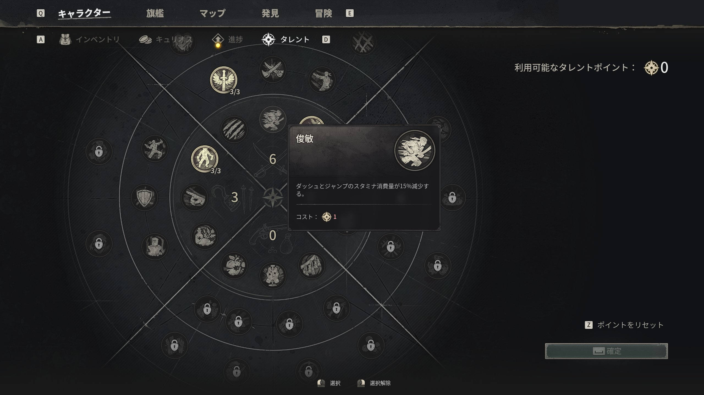
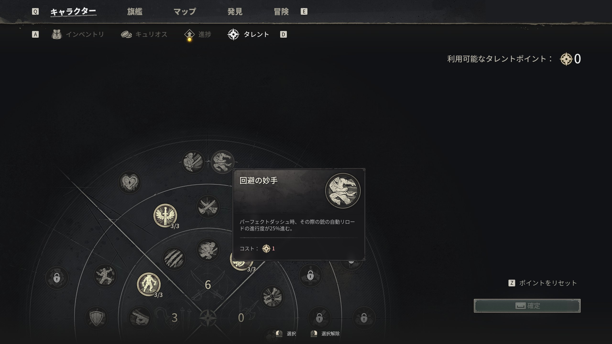
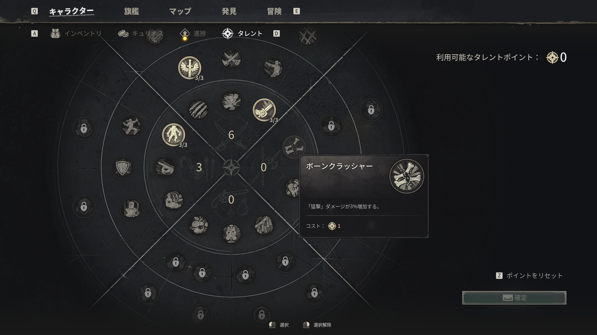

# タレント

> 情報源: [Steam コミュニティ ビギナーズガイド](https://steamcommunity.com/app/3041230/discussions/0/757304565299215807/) / [Boostmatch タレントガイド](https://boostmatch.gg/blog/windrose/articles/windrose-talent-tree-guide-all-branches) / [FextraLife Wiki](https://windrose.wiki.fextralife.com/Talents) / コミュニティ調査（2026年4月時点）

## タレントシステムの概要

レベルアップするとタレントポイントを獲得し、4つのタレントツリーに投資してキャラクターを強化します。

- **所持可能ポイント上限 = キャラクターレベル − 1**
- 各タレントは**最大3ランク**まで強化可能（強化するごとに効果が増加）
- 上位 Tier の解放には**下位 Tier への投資が必要**
- **経験値の主な入手源はクエスト完了とPOI発見**。雑魚狩りでは伸びにくい

4系統: **Fencer**（片手近接）/ **Crusher**（両手重武器）/ **Marksman**（遠距離）/ **Toughguy**（防御・生存）

Co-op 4人プレイでは1人ずつ異なる系統を担当することで役割分担が完成する。

---

## 全系統共通の推奨タレント（最優先）

### Marathon Runner（Toughguy Tier 0）
**全ビルドで最優先に取るべきタレント。**

最大スタミナを増加する。Windroseはスタミナ管理が根幹なので、系統を問わず全キャラが恩恵を受ける。

| ランク | 効果 |
|--------|------|
| Rank 1 | 最大スタミナ +20 |
| Rank 2 | 最大スタミナ +35 |
| Rank 3 | 最大スタミナ +50 |

### Agile（Fencer Tier 0）
ダッシュ・ジャンプのスタミナ消費を-15%削減。Marathon Runner の次に優先度が高い序盤タレント。

---

## Fencer系統（片手近接）

片手武器全般（サーベル・レイピア・カトラス・ピストル等）に対応。回避と連携した戦術が軸。

| Tier | タレント名 | 効果 |
|------|-----------|------|
| **Tier 0** | **Deep Cuts** | 斬撃ダメージ+3% |
| **Tier 0** | **Agile** | ダッシュ・ジャンプのスタミナ消費-15%。**序盤推奨** |
| **Tier 0** | **Surgical Cuts** | 片手近接クリティカル率+3% |
| Tier 1（3pt要） | **Quick Strikes** | 片手武器ダメージ+4% |
| Tier 1 | **Perfect Counter** | パーフェクトブロック後12秒間クリティカル率+5% |
| Tier 1 | **Duelist** | 10m以内に敵が1体のみの時ダメージ+6% |
| Tier 2（6pt要） | **Disciplined Fencer** ★ | パーフェクトブロックでパッシブリロード進行+15%回復 |
| Tier 2 | **Evasive Fencer**（回避の妙手） ★ | パーフェクトダッシュでパッシブリロード進行+25%回復（★いずれか選択） |
| Tier 2 | **Executioner's Grace** | キル後20秒間、毎ティックHP+10回復 |
| Tier 2 | **Deadly Finale** | 連続ヒットごとにダメージ+3%、5ヒットでキャップ |

★ Disciplined / Evasive Fencer は**どちらか一方を選択**するノード。

---

## Crusher系統（両手重武器）

グレートソード・ハルバード・クラブ等の両手重武器に対応。重攻撃と体幹（よろけ）破壊を軸とした戦術。

| Tier | タレント名 | 効果 |
|------|-----------|------|
| **Tier 0** | **Bonecrusher** | 猛撃ダメージ+3% |
| **Tier 0** | **Retribution** | 攻撃による一時HP→実HPへの変換効率+40% |
| Tier 1（3pt要） | **Massive** | 両手武器ダメージ+5% |
| Tier 1 | **Perfected Form** | 両手武器攻撃のスタミナ消費-10% |
| Tier 1 | **Executioner's Aim** | 両手近接クリティカル率+4% |
| Tier 2（6pt要） | **Berserk** | HP15%失うごとにダメージ+3%スタック |
| Tier 2 | **Dominating Presence** | 8m以内で敵死亡時60秒間近接ダメージ+6% |
| Tier 2 | **Momentum** | 2体以上同時ヒットでダメージ+5%、最大3スタック |

---

## Marksman系統（遠距離・銃器）

ピストル・マスケット・ラッパ銃等の遠距離武器に対応。射程管理と銃撃のタイミングを重視。

| Tier | タレント名 | 効果 |
|------|-----------|------|
| **Tier 0** | **Planning Ahead** | パッシブリロード速度+5% |
| **Tier 0** | **Deep Impact** | 刺突ダメージ+3% |
| **Tier 0** | **Bull's Eye** | クリティカル部位ヒット時ダメージ+5% |
| Tier 1（3pt要） | **Firearm Training** | 遠距離ダメージ+5% |
| Tier 1 | **Quick Hand** | アクティブリロード速度+10% |
| Tier 2（3pt要） | **Muzzle Reach** ★ | 10m以内でダメージ+4%（ラッパ銃向き） |
| Tier 2 | **Extended Reach** ★ | 10mごとにダメージ+1%（マスケット向き）（★いずれか選択） |
| Tier 3（6pt要） | **Bulletstorm** | ミスなし連続ヒットでダメージ+5%スタック |
| Tier 3 | **Sniper's Focus** | エイム中2秒ごとにダメージ+3%、最大4スタック |
| Tier 3 | **Deadly Hunter** | 敵キル時15%の確率で即座にリロード |
| Tier 3 | **Overpenetration** | 弾丸が敵を貫通（貫通後ダメージ-50%） |

★ Muzzle Reach / Extended Reach は**どちらか一方を選択**するノード。ラッパ銃ならMuzzle、マスケットならExtendedを選ぶ。

---

## Toughguy系統（防御・生存）

生存力・被ダメージ軽減・戦闘継続能力に特化した系統。全ビルドとの親和性が高い。

| Tier | タレント名 | 効果 |
|------|-----------|------|
| **Tier 0** | **You Will Answer for This** | 被ダメージ時の一時HP獲得量+25% |
| **Tier 0** | **Marathon Runner** | **最大スタミナ +20/+35/+50（Rank 1/2/3）。全ビルド最優先** |
| **Tier 0** | **Stitches and Rum** | 回復アイテムの回復効果+10% |
| Tier 1（3pt要） | **Just a Flesh Wound** | 近接ダメージ耐性 +6%/+9%/+12%（Rank 1/2/3） |
| Tier 1 | **Flawless Defence** | ブロックの体幹消費-15% |
| Tier 1 | **Outnumbered** | 近くに敵2体以上の時近接ダメージ+4% |
| Tier 2（6pt要） | **Too Angry to Die** | 致死ダメージ時にHP30%即時回復（クールダウン16分） |
| Tier 2 | **Stout Frame** | 最大HP +120/+180/+240（Rank 1/2/3） |

---

## ビルド別おすすめ初期タレント

| ビルド | 最初に取るべきタレント |
|--------|-------------------|
| どのビルドでも共通 | **Marathon Runner** → **Agile** |
| 片手近接（Fencer） | Marathon Runner → Agile → Deep Cuts |
| 両手重武器（Crusher） | Marathon Runner → Bonecrusher → Retribution |
| 遠距離（Marksman） | Marathon Runner → Planning Ahead → Bull's Eye |
| タンク（Toughguy） | Marathon Runner → You Will Answer for This → Stitches and Rum |

→ 各ビルドの装備構成は[ビルド集](builds.md)を参照
