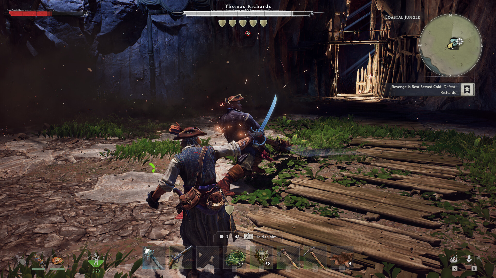

# 近接武器

> 情報源: [Steam ストアページ](https://store.steampowered.com/app/3041230/Windrose/) / [Steam コミュニティ ビギナーズガイド](https://steamcommunity.com/app/3041230/discussions/0/757304565299215807/)

## 戦闘の基本

- **ダメージを受けないことが最優先**。ブロックより回避を重視する
- **スタミナが最重要ステータス**。完全枯渇するとゲージが赤く点滅し、回復に時間がかかる。枯渇させないこと
- **ダッシュ（デフォルト: CTRL）** はスタミナを大きく消費するが回避に必須
- **後退歩きも有効な回避手段**として活用できる
- **被弾後に攻撃するとダメージの一部を回復できる**。タレントで強化可能
- **パリィは自分の体幹を消費しない**。敵の体幹を削る最も効率的な手段
- **敵のHPはセッション中に回復しない**。強敵は複数回に分けて削り倒すことが可能
- **焚き火（Campfire）** では戦闘外で自動回復できる。序盤の安全な回復手段として活用
- **パルティア戦術（Parthian Tactics）**: 1〜2回攻撃したら即離脱し、距離を取って敵を誘導するヒットアンドアウェイ。序盤の強敵に有効

## 近接武器カテゴリ

### サーベル（Saber）
片手刀。バランスの取れた近接武器です。扱いやすく、初心者にも向いています。

詳細ステータス・入手方法: 情報収集中

### レイピア（Rapier）
突き特化の細身の剣。**出血（Bleed）状態異常**を得意とする武器です。

ユニーク装備「千の刃のレイピア（Rapier of a Thousand Cuts）」はブリード（出血）を最大5スタックまで積み重ねる強力な一本です。

詳細ステータス・入手方法: 情報収集中

### ハルバード（Halberd）
長柄武器。リーチが長く、範囲攻撃に優れます。集団戦での立ち回りに向いています。

ユニーク装備「エクゼキューショナー（Executioner）」はキル時にクリティカル確率が上昇する効果を持ちます。

詳細ステータス・入手方法: 情報収集中

### グレートソード（Greatsword）
両手剣。高火力だがスタミナ消費が大きい重量級武器です。

詳細ステータス・入手方法: 情報収集中

## 武器素材ティア

近接武器はクラフト素材によってティアが上がります。

| ティア | 素材 | 入手時期 |
|--------|------|---------|
| 1 | 木製（Wood） | 序盤 |
| 2 | 石（Stone） | 序盤〜中盤 |
| 3 | 銅（Copper） | 中盤 |
| 4 | 鉄（Iron） | 後半 |

各ティアの詳細なレシピ・コストは情報収集中です。

## 武器比較（暫定）

| 武器 | 特徴 | 状態異常 | 備考 |
|------|------|----------|------|
| サーベル | バランス型 | なし | 初心者向け |
| レイピア | 突き・軽量 | 出血 | ブリードビルド向き |
| ハルバード | リーチ・範囲 | なし | 集団戦向き |
| グレートソード | 高火力・重量 | なし | スタミナ管理必須 |

詳細な数値・攻撃モーション比較は情報収集中です。

---

## 重要ステータス効果（知らないと損する仕様）

> 情報源: [fextralife Status Effects](https://windrose.wiki.fextralife.com/Status_Effects)

| 状態 | 効果 | 主な付与元 |
|------|------|----------|
| **Bleed（出血）** | 1 stack で **40 ダメ持続**、kill 時周囲の敵に伝染 | Rapier of a Thousand Cuts（5スタックで伝染特性発動） |
| **Plague Mark（疫病マーク）** | 1体に最大8スタック。**5以上消費でフルヒール**、8でVulnerability連動の burst window | Rapier of Devastation の軽攻撃 |
| **Vulnerability（脆弱）** | 被ダメ +X%。Plague Mark コンボの核 | Drake's Double-Barreled Pistol（Epic） |
| **Ward（防壁）** | 被ダメ -15% | Epic Executioner Halberd 装備パッシブ |
| **Take Aim!（狙い澄まし）** | 遠距離ダメ +最大9 stack | Cutlass の特定モーション |
| **Distortion（歪み）** | AoE デバフ | Swamp Creature's Tooth |
| **Winded（息切れ）** | スタミナ枯渇でスプリント・ダッシュ封印（自損ステータス） | スタミナ赤化 |
| **Temporal Health（時限HP）** | 失敗パリィで生成。Bleed tick で自動補填（Duelist 専用シナジー） | パリィ失敗 |

### Plague Mark コンボの実用例

Rapier of Devastation で **軽攻撃 8 連 → Drake's Pistol → Heavy Attack** の決定打ループは終盤メタの中核。詳細は [ビルド集](../character/builds.md#plague-mark-コンボs-火力ループ) を参照。

---

## パリィ性能の武器別差

> パリィの基本は「敵の体幹を削り、自分の体幹は消費しない」。ただし**武器によって挙動が大きく異なる**。

| 武器種 | パリィ性能 |
|--------|-----------|
| **Saber** | **完全無傷 + 自分のポスチャー保持**（Sturdy 派生で +1 段確保可） |
| **Rapier** | **シールド半減**（敵の体幹を半分削る） |
| **Greatsword** | 標準的にパリィ可 |
| **Club / Mace** | パリィ効果小 |
| **Halberd（Crude派生）** | **パリィ不可**。弱い攻撃のみ通る、自分の体幹消費 |

**数回パリィすると敵のポスチャーが崩れ、確定 DPS 窓が出る**。Saber が初心者から熟練者まで圧倒的に推されるのはこのパリィ性能による。

> 情報源: [Steam: parry weapon discussion](https://steamcommunity.com/app/3041230/discussions/0/807975542034834328/)
