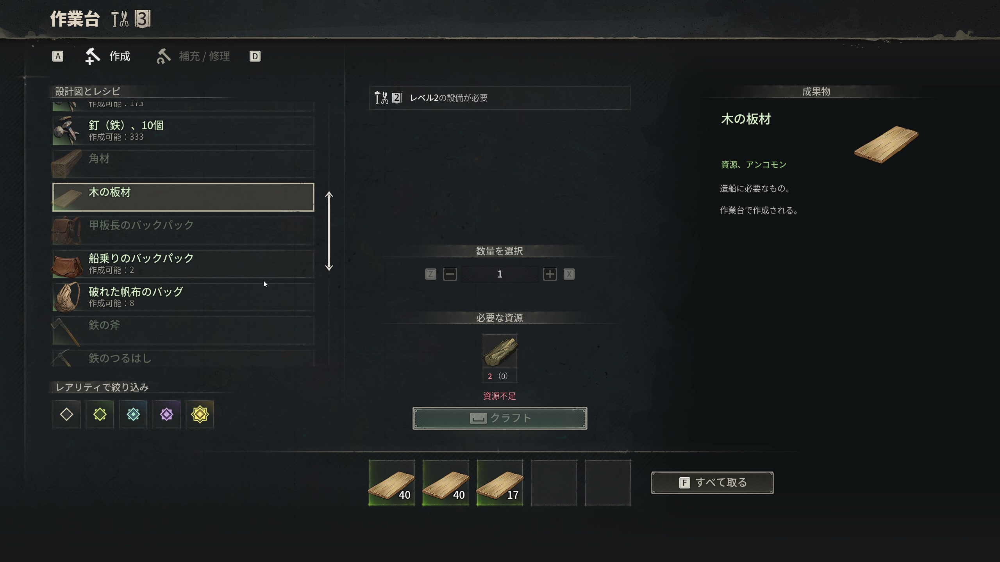
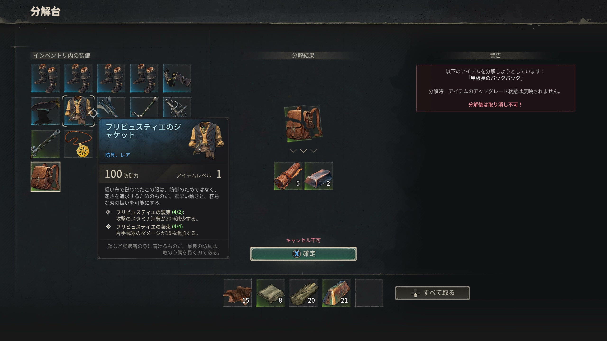

# クラフトステーション

> 情報源: [Steam コミュニティ ビギナーズガイド](https://steamcommunity.com/app/3041230/discussions/0/757304565299215807/) / [Boostmatch クラフト進行ガイド](https://boostmatch.gg/blog/windrose/articles/windrose-crafting-stations-progression) / [G-Portal Windrose Wiki](https://www.g-portal.com/wiki/en/windrose-beginners-quickstart-guide/)

## クラフト進行の全体像

Windrose のクラフトは「施設を建てる → 新しいレシピが解放される」という連鎖で進みます。

**序盤の基本連鎖**:
```
Workbench → Stone Tools → Copper Ore 採掘
→ Charcoal Kiln（木炭）→ Smelting Furnace（銅精錬）
→ Copper Ingot → 上位装備・施設へ
```

**重要**: Workbench の近接チェスト内の素材は**自動参照**されます（クラフト時に手動で移動する必要なし）。

---

## 施設一覧

### 作業台（Workbench）
序盤に最初に建てるべき施設。基本的なアイテムのほぼ全てをここでクラフトする。



| 項目 | 内容 |
|------|------|
| 主な用途 | 道具・武器・包帯・袋などのクラフト |
| 主要クラフト品 | 石のつるはし / 石の斧 / 包帯 / 裂けた帆布の袋 / たいまつ |
| アップグレード | Lv1→2→3 と段階的にアップグレード可。上位レシピが解放される |

**序盤の初期アイテム優先度**:
1. Torn Sailcloth Bag（持ち物拡張）: Coarse Fabric ×2 + Rope ×1
2. Stone Axe / Stone Pickaxe
3. Bandage ×10

---

### 炭焼き窯（Charcoal Kiln）
木材から木炭（Charcoal）を製造する。多くのレシピで必要になる。

| 主な用途 | Charcoal（木炭）の製造 |
|---------|----------------------|
| 木炭の用途 | 製錬炉の燃料・各種クラフト素材 |

---

### 製錬炉（Smelting Furnace）
鉱石をインゴットに精錬する施設。

| 主な用途 | 鉱石の精錬 |
|---------|----------|
| 精錬できる素材 | Copper Ore → Copper Ingot |
| Foothills 以降 | Iron Ore → Iron Ingot |
| 燃料 | Charcoal |

**注意**: Iron（鉄）の精錬は **Foothills バイオームでのみ可能**。

---

### 武器鍛冶台（Weaponsmith Workshop）
武器のクラフト・アップグレード・Ascension（Epic昇格）を行う。

| 主な用途 | 武器クラフト / Lv強化 / Epic昇格 |
|---------|--------------------------------|
| Ascension素材 | **Tumbaga Ingot**（Rare Lv8 → Epic に昇格） |
| Tier 2 要件 | Anvil（鍛冶台） |
| Tier 3 要件 | Anvil + Bellows（鞴） |

---

### アップグレードステーション（Upgrading Station）
武器・防具・バッグのアップグレードを行う。

**注意**: Common/Uncommon を強化しても Epic になれない。**Rare 以上のアイテムへの投資を優先する**。

---

### 解体台（Dismantling Bench）
不要なアイテムを素材に戻す施設。



| 返却率 | **基本コストのみ100%返却** |
|-------|--------------------------|
| 注意点 | **強化に使った素材は戻らない** |

---

### 造船台（Shipwright's Workshop）
船の部品（大砲等）を製造する施設。

| 主な用途 | 大砲・船部品の製造 |
|---------|-----------------|
| 主要クラフト品 | **12-Pounder Cannon**（Copper Ingot ×10・Wood ×10） |
| 解放クエスト | Seafarer（シーファラー） |

---

### 桟橋（Wharf）
船の建造・修理・カスタマイズを行う施設。

| 建設素材 | Wood ×10・Coarse Fabric ×10 |
|---------|----------------------------|
| 設置条件 | **水際（海岸線）に設置必須** |
| 主な用途 | 船の建造 / 修理 / カスタマイズ |

---

### 料理台（Cooking Fire）
食事バフアイテムをクラフトする施設。

| 特徴 | **マップのどこにでも設置可能** |
|------|------------------------------|
| 上位施設 | Millstone（Phase 2、※現在無効化中）/ Culinary Station / Food Dryer（Phase 3） |

> ⚠️ **Millstone は現在ゲーム内で無効化されている**（Early Access 2026年4月時点）。将来のアップデートで実装予定。

→ 詳細は[料理](cooking.md)を参照

---

### 錬金テーブル（Alchemy Table）
ポーション・エリクサーを調合する施設。

| 解放素材 | **Misty Orchid（霧の蘭）** — Foothills で入手 |
|---------|---------------------------------------------|
| Lv2 解放 | Stove and Pot（Stone ×5 / Clay ×5 / Copper Pot ×1）を隣接設置 |

→ 詳細・レシピは[錬金術](alchemy.md)を参照

---

### エンチャントテーブル（Enchanting Table）

Arborum 素材を使って装備に魔法特性を付与する**終盤の最上位クラフト施設**。

| 解放条件 | Swamp / Foothills の Ruins で **Ancient Scraps** を入手 |
|---------|------------------------------------------------------|
| 建築素材 | Mire Metal Ingot ×3 / Hewn Stone ×10 / Plant Fiber ×10 / Essence Arborum ×2 |
| 前提施設 | **Large Smelting Furnace**（屋外設置専用） |
| 配置要件 | **屋根必須** + **Bonfire 暖気範囲内** |

→ 詳細は[エンチャント](enchanting.md)を参照

---

## 序盤の施設建設優先順位

| 優先 | 施設 | 理由 |
|------|------|------|
| 1 | **Workbench** | 全てのクラフトの起点 |
| 2 | **Charcoal Kiln** | 製錬炉の燃料確保 |
| 3 | **Smelting Furnace** | 銅インゴット製造 |
| 4 | **Upgrading Station** | 装備強化 |
| 5 | **Weaponsmith Workshop** | 武器クラフト・Epic昇格 |
| 6 | **Wharf** | 船の建造（Seafarer クエスト） |
| 7 | **Alchemy Table** | ポーション自作（Misty Orchid 入手後） |
