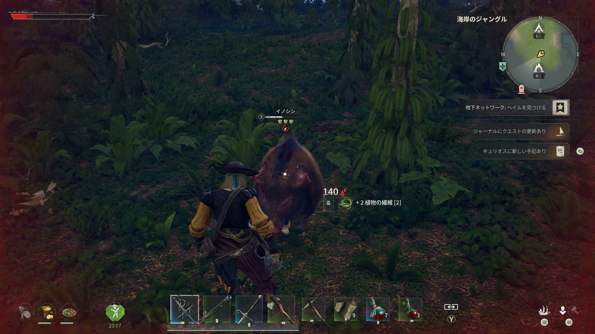
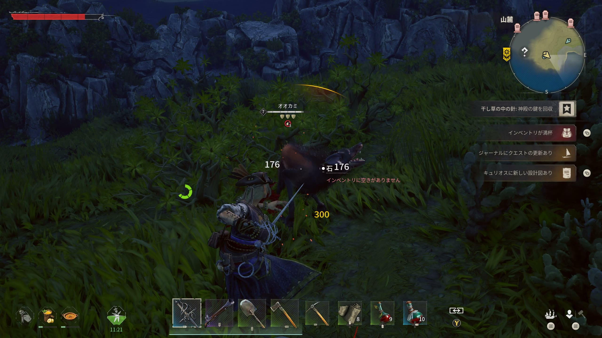

# 一般エネミー

> 情報源: [Steam コミュニティ ビギナーズガイド](https://steamcommunity.com/app/3041230/discussions/0/757304565299215807/)

## 野生動物

### ドードー（Dodo）
序盤に最初に相対する敵対動物です。

| 項目 | 内容 |
|------|------|
| 出現場所 | 第一島（序盤エリア） |
| 危険度 | 低 |
| 対処法 | 基本的な近接攻撃で対応可能 |
| 備考 | 序盤から敵対的 |

---

### イノシシ（Boar）
序盤の強めの野生動物です。種類によって危険度が異なります。

| 名前 | 危険度 | 特徴 |
|------|--------|------|
| イノシシ（Boar） | 低〜中 | 基本的なイノシシ |
| チャージングボア（Charging Boar） | 中 | 突進攻撃を使う。第二島に出現 |
| サベージボア（Savage Boar） | 中〜高 | より強力な個体。第二島に出現 |

**対処法**: チャージングボアの突進は横に回避する。スタミナを温存しながら戦うことが重要。

### メスイノシシ（Sows）

Boar系統の別種として確認されている。

| 名前 | 危険度 | 特徴 |
|------|--------|------|
| Sows（メスイノシシ） | 低〜中 | Lv3相当。Boar系の変種 |

---

### ソーンフィドラー（Thorn Fiddler）

| 項目 | 内容 |
|------|------|
| 出現場所 | **Coastal Jungle**（夜間） |
| 危険度 | 中 |
| 特徴 | カニ系の変種。Drowned・Undeadと同じく夜間限定で出現 |

---

### オオカミ（Wolf）

| 名前 | 危険度 | 特徴 |
|------|--------|------|
| Wolf | 中 | 群れで行動する。山麓バイオームに出現 |
| Alpha Wolf | 中〜高 | 高HP。群れのリーダー格 |

**対処法**: 複数同時に引きつけないよう、群れの端から1体ずつ処理する。

---

## 人型の敵

### 溺死者（Drowned）

Weevil Ship クエストで遭遇する人型の水死体系の敵。

| 項目 | 内容 |
|------|------|
| 出現場所 | **Weevil Ship**（Coastal Jungle エリアのクエスト対象船） |
| レベル | **7** |
| 危険度 | 中〜高（多数が密集） |
| 特殊仕様 | **船の外にいると無限スポーン**。乗船状態を維持するとスポーンが止まる |

**攻略のポイント**: Drowned は乗船中でなければ無限に湧き続ける。乗り込んだら退かず、乗船状態を維持することでスポーンを止められる。詳細は[島ガイド・Weevil Ship](../exploration/islands.md)を参照。

### グレネーダー（Grenadier）

| 項目 | 内容 |
|------|------|
| 出現場所 | Coastal Jungle 系エリア（海賊キャンプ等） |
| 危険度 | 中 |
| 特徴 | 爆発物を投擲する人型敵。Hotfix 0.10.0.2.54 でAI挙動が改善された |

その他の人型敵（海賊・スケルトン等）については情報収集中。

## アンデッド・呪われた敵

### Plague Thralls（疫病の下僕）

| 項目 | 内容 |
|------|------|
| 出現場所 | **Cursed Swamp** — Stargazer Tower 内部（Ancient Chest 付近） |
| 危険度 | 中〜高 |
| 対処法 | タワー内は狭く密集しやすい。遠距離武器での先制推奨 |
| 備考 | Fate of the Prophets クエスト中に複数出現。チェスト回収前に掃除する |

---

## Cursed Swamps の敵

### Plague Hunter（疫病の狩人）

| 項目 | 内容 |
|------|------|
| 出現場所 | **Cursed Swamps** |
| 危険度 | 中〜高 |
| ドロップ | **Quagmire Powder**（Mire Metal Ingot・エンチャント素材） |
| 備考 | Plague Warrior / Plague Witch と同じく Plague tribe に属する |

### Plague Warrior（疫病の戦士）

| 項目 | 内容 |
|------|------|
| 出現場所 | **Cursed Swamps** |
| 危険度 | 中〜高 |
| ドロップ | **Quagmire Powder** |

### Plague Witch（疫病の魔女）

| 項目 | 内容 |
|------|------|
| 出現場所 | **Cursed Swamps** |
| 危険度 | 高 |
| ドロップ | **Tear of Sorrow**、**Mysterious Spice**（Discoveries 素材） |
| 備考 | パッチ 0.10.0.3.104 で羽毛シミュレーションのバグが修正された |

### Plague Crocodile（疫病のワニ）

| 項目 | 内容 |
|------|------|
| 出現場所 | **Cursed Swamps** |
| 危険度 | 高 |
| 備考 | High Priestess 周辺エリアに出現。ボスへの接近時に注意 |

### Senkamati Corrupted

| 項目 | 内容 |
|------|------|
| 出現場所 | **Cursed Swamps** |
| 危険度 | 要調査 |
| 備考 | 存在が確認されているが詳細不明【要検証】 |

## バイオーム別の敵一覧

各バイオームに固有の敵が存在します。詳細は情報収集中。
