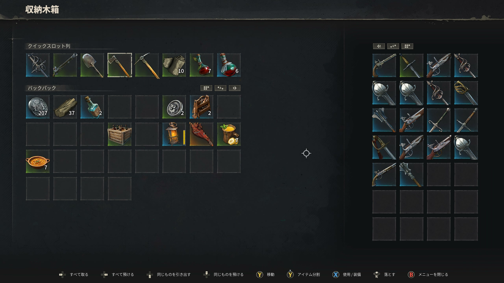

# 装備概要

> 情報源: [Steam ストアページ](https://store.steampowered.com/app/3041230/Windrose/) / [Steam コミュニティ ビギナーズガイド](https://steamcommunity.com/app/3041230/discussions/0/757304565299215807/)

## 装備カテゴリ

| ページ | 内容 |
|--------|------|
| [武器一覧](weapons.md) | 全武器のステータス・入手方法・性能比較 |
| [防具一覧](armor.md) | 防具セットの効果・性能・入手方法 |
| [ユニーク装備](uniques.md) | ユニーク武器・防具の特殊効果と入手場所 |

## 装備の基本

- 武器は近接と遠距離の両方を組み合わせて使用
- 防具はセット効果に注目して選ぶ
- ユニーク装備は特殊効果を持つ強力なアイテム
- 武器鍛冶台（Weaponsmith Station）でアップグレード可能

## ロードアウト

目的に応じて装備を切り替えるロードアウト機能があります。詳細は情報収集中。
