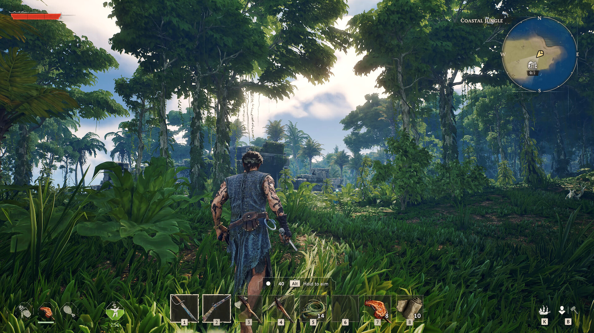

# 探索概要

> 情報源: [Steam ストアページ](https://store.steampowered.com/app/3041230/Windrose/)

Windroseの世界は3つのバイオームにまたがる広大な海洋世界です。約30個の手作り生成島と90以上のハンドクラフトされたPOI（ポイント・オブ・インタレスト）が待っています。

## 各サブページ

| ページ | 内容 |
|--------|------|
| [バイオーム](biomes.md) | 3つのバイオームの特徴・資源・敵 |
| [島ガイド](islands.md) | 主要な島の概要と攻略ポイント |
| [ダンジョン・POI](dungeons.md) | 100以上のダンジョン・POIのガイド |

## 探索の基本

- **ファストトラベルベル（Fast Travel Bell）**を活用: 拠点や重要地点に設置（最大10個）
- 埋蔵金を見逃すな: 赤い布がついた木の近くを掘ると宝が見つかることがある
- バイオームごとに異なる敵・資源・ボスが存在する
