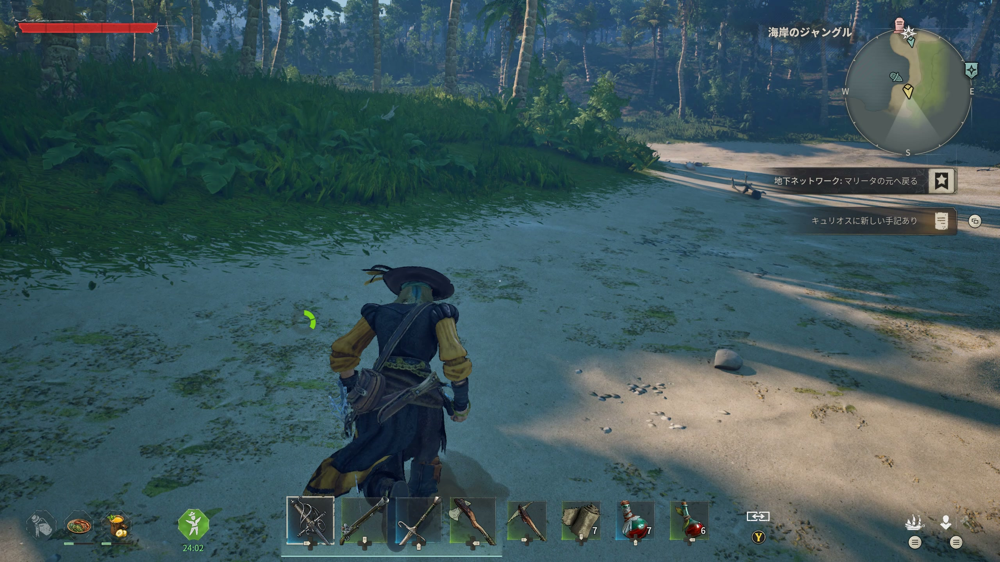
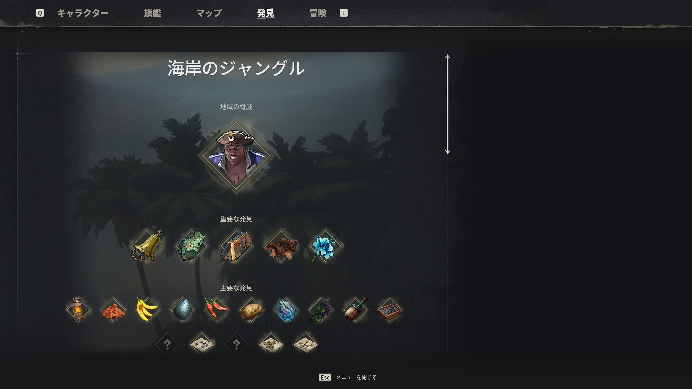
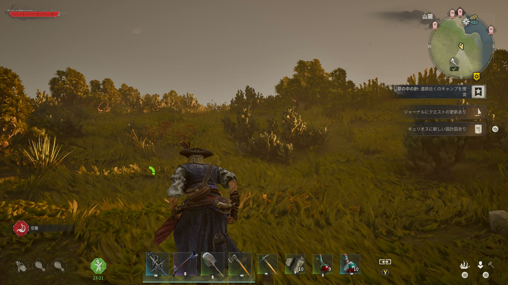
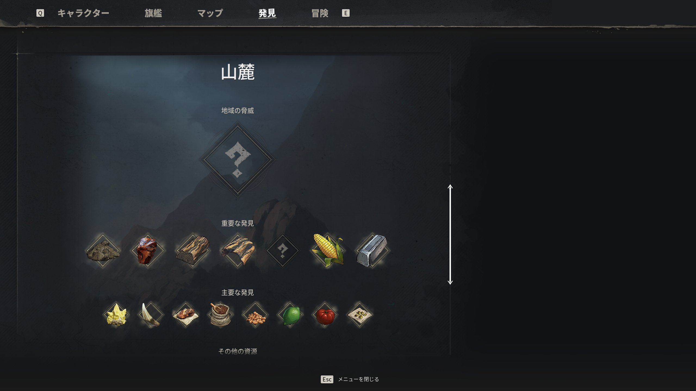
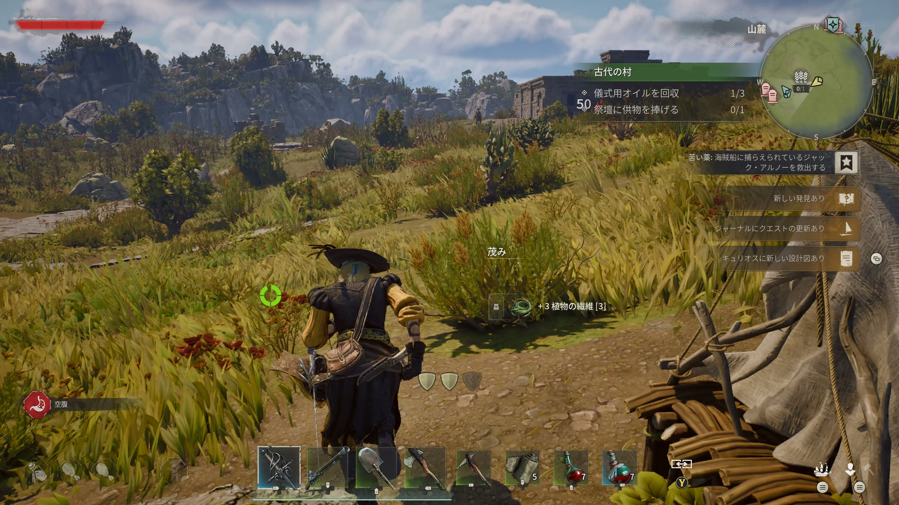
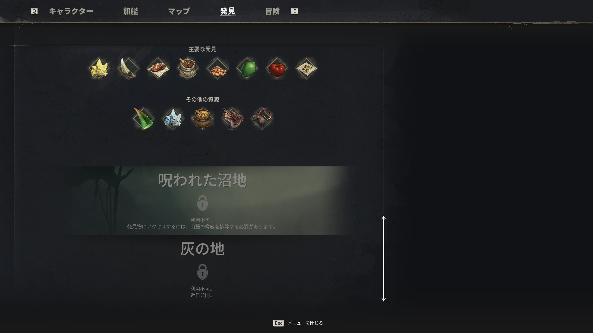
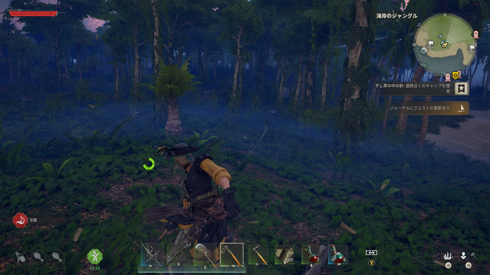

# バイオーム

> 情報源: [Steam ストアページ](https://store.steampowered.com/app/3041230/Windrose/) / [Boostmatch 初心者ガイド](https://boostmatch.gg/blog/windrose/articles/windrose-beginners-guide-survive-or-quit-trying) / [G-Portal Wiki](https://www.g-portal.com/wiki/en/windrose-island-exploration-guide/) / [allthings.how Windrose ガイド](https://allthings.how/)

## バイオームの概要

Windroseには**3つのバイオーム**が存在し、それぞれ固有のクエスト・敵・ボス・資源が用意されています。**ギアレベル（装備推奨レベル）**が上がるごとに新しいバイオームへ進出します。

| バイオーム | ギアレベル | 難易度 | 特徴 |
|-----------|-----------|--------|------|
| **海岸のジャングル（Coastal Jungle）** | Lv 1〜5 | 序盤 | チュートリアル的なバイオーム |
| **山麓（Foothills）** | Lv 6〜10 | 中盤 | 鉄・薬草が解放される |
| **呪われた沼地（Cursed Swamps）** | Lv 11〜15 | 終盤 | 高難度・古代遺跡・希少素材 |

**ボスを倒すと次バイオームのギア製作が解放**される。

---

## 海岸のジャングル（Coastal Jungle）
**推奨ギアレベル: 1〜5**

ゲーム開始地点となるチュートリアル的なバイオーム。まずここで生存の基礎を固める。

> **発見タブ**: 各バイオームで入手可能な素材・敵・POI を「重要な発見 / 主要な発見 / その他の発見」の3段階でコレクション表示する。未発見スロットは ? で示され、進行度の指標になる。

### 主な資源

| 資源 | 入手方法 |
|------|---------|
| 銅鉱石（Copper Ore） | 洞窟内の銅鉱脈（Pickaxe 必須） |
| 粘土（Clay） | 浜辺固定スポーン（Pickaxe で採取） |
| Plant Fiber / Hemp | 草むらで手採取 |
| 木材（Pinewood Logs） | 樹木を斧で伐採 |
| ヤシの実（Coconut） | ヤシの木を揺らす（伐採しないこと） |

### 主な敵

| 敵 | 特徴 |
|----|------|
| ドードー（Dodo） | 無害・主な食糧源 |
| イノシシ（Boar） | Lv1〜3で段階的に強くなる |
| **Boar Lv3** | **序盤最大の脅威。海賊より危険** — 不意に近づかないこと |
| 海賊（Pirate） | 火薬・弾薬を持つことがある |

### 序盤の優先入手アイテム（第1島）

1. **千切りのレイピア（Rapier of a Thousand Cuts）** — 赤い旗がついた木の近くを掘る（埋蔵金）
2. **タンバガインゴット（Tumbaga Ingot）** — Abandoned Buccaneer Warehouse（隠しパズルあり）
3. **ヴァイタリティのネックレス・小（Minor Necklace of Vitality）** — +4 VIT

### ボス

- **トーマス・リチャーズ（Thomas Richards）** — クエスト「Revenge is Best Served Cold」
- 撃破で Foothills のギア（Lv6〜）が解放

---

## 山麓（Foothills）
**推奨ギアレベル: 6〜10**

中盤バイオーム。鉄鉱石・薬草など上位素材の入手地。Coastal Jungle のボス撃破で解放。

### 主な資源

| 資源 | 入手方法 | 備考 |
|------|---------|------|
| 鉄鉱石（Iron Ore） | マップのピッケルアイコン鉱床 | **海岸のジャングルでは精錬不可** |
| Sulfur（硫黄） | 黄色い岩の堆積 | 火薬・錬金素材 |
| Hardwood / Ironwood | Divi-Divi 木を伐採 | 上位木材 |
| Medicinal Herb（薬草） | 草原に自生 | Alchemy 材料 |
| Flax Fiber / Coffee Beans | 農作物 | Corn / Banana も入手可 |

### 主な敵

| 敵 | 特徴 |
|----|------|
| Wolf / Alpha Wolf | 群れで行動。Alpha は高HP |
| Mountain Goat | 素材（Bezoar＝山羊の結石）ドロップ |
| Pirate Sergeant 等 | Coastal より強化された人型海賊 |

### 主なPOI

| POI | 概要 |
|-----|------|
| **Foothills Temple** | Lv.10推奨。**Foothills Temple Key**が必要（北部の死んだ海賊から入手）。Israel Hands ボス部屋あり |
| Ancient Village / Farm | ランドマーク表示。Ancient Scraps・素材の固定スポット |
| Iron Deposit | 鉄鉱石の大型採掘拠点 |

### 特記事項

- **鉄（Iron）はこのバイオームでのみ採掘・精錬可能**。鉄製ツール・武器への昇格に必須
- 第2島到着直後に **Bonfire・Tent・ファストトラベルベル** を設置する習慣をつける
- **Misty Orchid（霧の蘭）** を発見すると **Alchemy Table（錬金テーブル）** が解放 → ポーション自作が可能になる

### ボス

**イスラエル・ハンズ（Israel Hands）** — クエスト「Needle in a Haystack」の到達点。撃破で Cursed Swamps のギア（Lv11〜）が解放。詳細は[ボス攻略](../enemies/bosses.md)を参照。

---

## 呪われた沼地（Cursed Swamps）
**推奨ギアレベル: 11〜15**

最終バイオーム（EA時点）。**Plague ハザード**・高難度エネミー・古代文明の遺跡が点在する。

> 発見タブには **灰の地（Ashlands）** がロック状態で表示されている。**Ashlands は Early Access のロードマップで追加予定の新バイオーム**で、現状では到達不可。

### 主な資源

| 資源 | 入手方法 | 用途 |
|------|---------|------|
| Ancient Scraps | 沼の遺跡・Ancient Ruins | クラフトステーション解放に必須 |
| Tar | 沼地採取 | 建材・素材 |
| Plague Wood | 伐採 | エンチャント素材（Essence Arborum精錬） |
| Essence Arborum | Plague Wood → 炉で精錬 | エンチャント必須素材 |
| Bromeliad | 沼地自生 | 錬金素材 |
| Tear of Sorrow | ボスドロップ等 | クラフト素材 |
| Tainted Bile | Plague Crocodile ドロップ | 錬金素材 |

### 主な敵

| 敵 | 特徴 |
|----|------|
| Crocodile | 通常種。Croc Hide / Tail ドロップ |
| **Plague Crocodile** | **Tainted Bile** ドロップ。毒効果あり |
| Drowner（沼地ゾンビ） | 数が多く群れで来る |
| **Swollen Drowned** | 毒液AoEを吐く。**180度範囲は回避不可** |
| Plague Thralls | DoT（Plague）付与。超常系アンデッド |

### Plague（疫病）ハザード

- Plagued Wood 区域に入ると **Plague メーター**が出現し、放置すると継続ダメージ
- Plague Thralls の攻撃・DoT でも付与される
- **拠点をこのバイオームに構える前に Plague 管理手段を確保すること**

### 主なPOI

| POI | 概要 |
|-----|------|
| Ancient Ruins | **Ancient Scraps の最効率入手場所**。クラフトステーション解放に必須 |
| Ruin with a Flowerbed | Beans・Leek の採取地点（固有ランドマーク） |

### ボス

**High Priestess（ハイプリーステス）** — クエスト「Forgotten Relics」最終段階。膿胞破壊→弱点露出ループが攻略の核心。詳細は[ボス攻略](../enemies/bosses.md)を参照。

---

## 島のタイプ

各バイオーム内に複数の島が存在し、島ごとに特徴が異なります。

| 島タイプ | 特徴 | 主な入手物 |
|---------|------|-----------|
| **Coastal Island** | 標準的な海岸・浜辺 | 基本素材・銅・粘土 |
| **Jungle Island** | 密林 | Ironwood（上位木材） |
| **Volcanic Island** | 火山地形 | Sulfur（硫黄）・Lava Crystal |
| **Abandoned Settlement** | 古代集落跡 | Artifact Chest・Ancient Coins（古代コイン） |

---

## 探索の基本ルール

- **夜間は危険度が上昇する** — 夜間探索は装備を整えてから
- **洞窟内は特に危険** — 序盤は軽率に入らない
- **ファストトラベルベルを最大10箇所**設置しておくと安全に探索できる
- 高リスクエリアほど良い素材・装備が手に入る
- 資源の豊富な島が見つかったらすぐにFTベルを設置して確保する

## サバイバルループ

**SURVIVE → BUILD → FORGE → FIGHT → EXPAND** のサイクルで進行。

各フェーズで得た素材・装備を次フェーズへの投資として回すことがゲームの核心。
