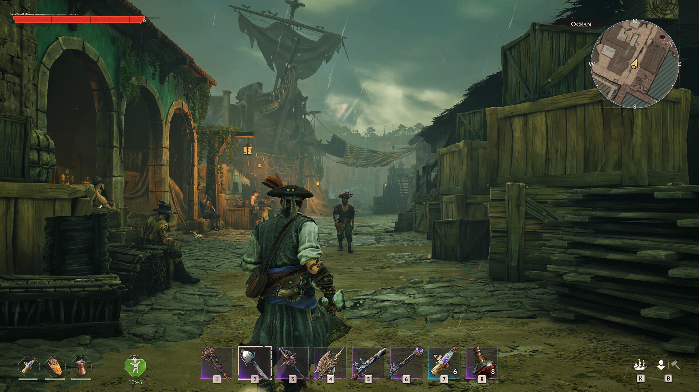

# 島ガイド

> 情報源: [Steam コミュニティ ビギナーズガイド](https://steamcommunity.com/app/3041230/discussions/0/757304565299215807/)

## 島の概要

Windroseには**約30個の手作り生成島**が存在します。各島には固有のイベント・資源・敵が配置されています。

## 確認済みの島情報

### 第一島（序盤スタート島）

**入手できるもの**:
- 埋蔵金（赤い布の木の近くを掘る）
  - 小さな生命力のネックレス（Minor Necklace of Vitality）: 生命力（VIT）+4
  - ランプ（Lamp）
- タンバガインゴット（Tumbaga Ingot）の採集スポット

**主な資源**:
- 木材・石材
- 銅鉱石

**注意**: ドードーは序盤から敵対的です。

---

### 第二島

**入手できるもの**:
- ミスティオーキッド（Misty Orchid）: 錬金テーブルの解放素材
- 癒しのハーブ（Healing Herbs）まとまった採取スポット（15個前後）
- ヤシの実（ヤシの木あり）

**出現する敵**:
- チャージングボア（Charging Boar）
- サベージボア（Savage Boar）※より危険

---

その他の島の詳細・マップ・固有コンテンツは情報収集中です。
