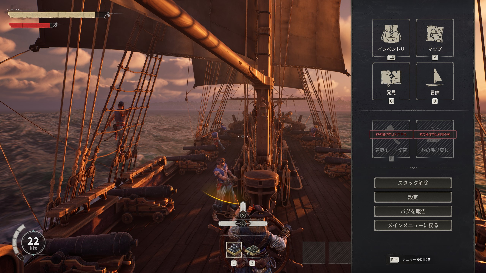

# キーバインド完全版

ゲーム内のキー設定画面に載っていない操作を含む、全コンテキストのキー一覧です。

> 情報源: [BisectHosting Controls Guide](https://www.bisecthosting.com/blog/windrose-controls-pc-keyboard-mouse-controller-gamepad-xbox-playstation) / [Slashskill Hidden Mechanics](https://www.slashskill.com/windrose-tips-and-tricks-hidden-mechanics-the-game-never-explains/) / Steam コミュニティ

> ⚠️ **コントローラのキー再割り当ては現在非対応**（2026年4月時点）。マウス・キーボードのリバインドは設定画面から変更可能。

---

## 地上移動・基本操作

> **ESCメニュー**: ESCを1回押すとインベントリ・マップ・発見・冒険・建築モードへ・拠点へ呼び戻し・スタック解除・設定・バグ報告・メインメニューへ戻る、の主要メニューが一画面に集約される。各項目には対応キー（インベントリ=I 等）も併記されているため操作確認に便利。

| キー | 動作 |
|------|------|
| WASD | 移動 |
| SHIFT | スプリント（ダッシュ） |
| CAPS LOCK | **歩き（低速移動）** |
| CTRL | ドッジ（回避） |
| SPACE | ジャンプ |
| E | インタラクト |
| TAB / I | インベントリ |
| M | マップ |
| G | Discovery（発見タブ） |
| J | Adventure（冒険ログ・クエスト） |
| O | キャラクター外見変更（いつでも変更可） |
| ESC | メニュー |

---

## 戦闘

| キー | 動作 |
|------|------|
| 左クリック | ライト攻撃 |
| **中クリック（ホイール押し込み）** | **ヘビー攻撃 / 武器別特殊攻撃**（要暗記） |
| **F** | **Special Attack**（武器固有の特殊技） |
| 右クリック（長押し） | ブロック / パリィ |
| T | ターゲットロック |
| [ / ] | ターゲット切替（左/右） |
| R | リロード |
| **R（長押し）** | **武器しまう（Holster）** |
| 1〜4 | ホットバースロット切替 |
| 5〜8 | **船搭乗中の消耗品スロット**（Wharf で設定） |

### 武器別 中クリックの挙動

| 武器 | 中クリック効果 |
|------|-------------|
| サーベル（Saber） / グレートソード（Greatsword） | ヘビースラッシュ |
| **レイピア（Rapier）** | **2連続スラスト（二段斬り）** |
| **マスケット銃（Musket）** | **精密射撃（ダメージ倍率UP）** |
| ハルバード（Halberd） | 広範囲の薙ぎ払い |
| ピストル（Pistol） | 特殊射撃 |
| ラッパ銃（Blunderbuss） | チャージショット系 |

### Special Attack（F キー）の挙動

武器種によって異なる。Plague Marks が5スタックで Rapier of Devastation の F が解禁されるなど、**一部武器は条件付きでトリガー**する。

---

## インベントリ・アイテム操作

| 操作 | 動作 |
|------|------|
| 左クリック | アイテム選択 |
| 右クリック | **マップ上でカスタムマーカー設置** / アイテムの分割・特殊操作 |
| Scallop Shell を右クリック | **Pearl（真珠）を取り出す** |
| **チェストで「Quick Deposit」** | 同種アイテムが入ったチェストへ自動仕分け |
| X / Z | シャベルモード切替 |

---

## 建築モード

建築モード（B キーで開閉）内での追加操作：

| キー | 動作 |
|------|------|
| B | 建築メニュー開閉 |
| **Z** | **Shift Block（隣接ブロックとの干渉調整）** |
| **P** | **Snapping トグル（グリッド吸着ON/OFF）** |
| **L** | **Rotation Step（回転ステップ変更）** |
| **マウスホイール** | **建物の回転** |
| E | 設置 |
| X / Right-click | 設置キャンセル |

---

## 船・海上操作

| キー | 動作 |
|------|------|
| **K** | **船をどこからでも呼び寄せ（召喚）** |
| W / S | スロットル増/減 |
| A / D | 操舵（旋回） |
| 左クリック | 砲撃（左舷/右舷/前方の照準方向） |
| **SPACE** | **Boarding 開始（Disabled 状態の敵船に横付けで発動）** |
| **E** | **操舵を離れる** |
| **F** | **カメラ視点切替（引き視点↔通常）** |
| **B** | **Sea Shanty（シャンティ）トグル** |
| **N** | **次の Sea Shanty 曲へ切替** |
| M | マップを開く（**操舵中でもファストトラベル可**） |
| K | 地図を開く（同上） |

### スロットル段階の使い方

| 速度 | 最適な用途 |
|------|-----------|
| 全速（Full） | 接近・逃走 |
| **3/4 速** | **旋回・ブロードサイド維持**（海戦の基本速度） |
| 1/4 速 | 敵船尾への滑り込み・慎重な接近 |
| 停船 | 地図自動生成・アイテム自動回収待ち |

---

## ベッド・テント

| 操作 | 動作 |
|------|------|
| Tent に E | **アクティベート（リスポーン地点設定）**。設置だけでは機能しない |
| Simple Bed に Q | **夜飛ばし（時間早送り就寝）**。屋根付きの室内のみ可 |

---

## コントローラ対応（参考）

| 操作 | Xbox | PS |
|------|------|----|
| ライト攻撃 | RB | R1 |
| ヘビー攻撃 | RT | R2 |
| ブロック | LB | L1 |
| ドッジ | B | ○ |
| インタラクト | Y | △ |
| **Special Attack** | **LB + RB 同時押し** | **L1 + R1 同時押し** |
| ターゲットロック | 右スティック押し込み | R3 |
| インベントリ | Select / View | Touchpad |

> ⚠️ **コントローラのキー再割り当ては現在非対応**（2026年4月時点）。

---

## 関連ページ

- [初心者Tips](tips.md)
- [ゲームが教えてくれない仕様](hidden-mechanics.md)
- [基本アクション](combat/basic-actions.md)
- [海戦ガイド](ships/naval-combat.md)
