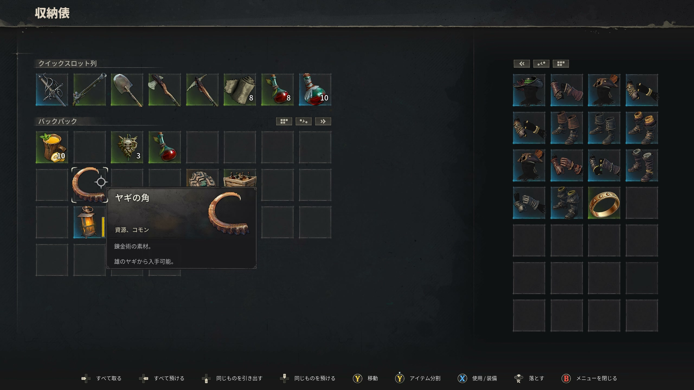
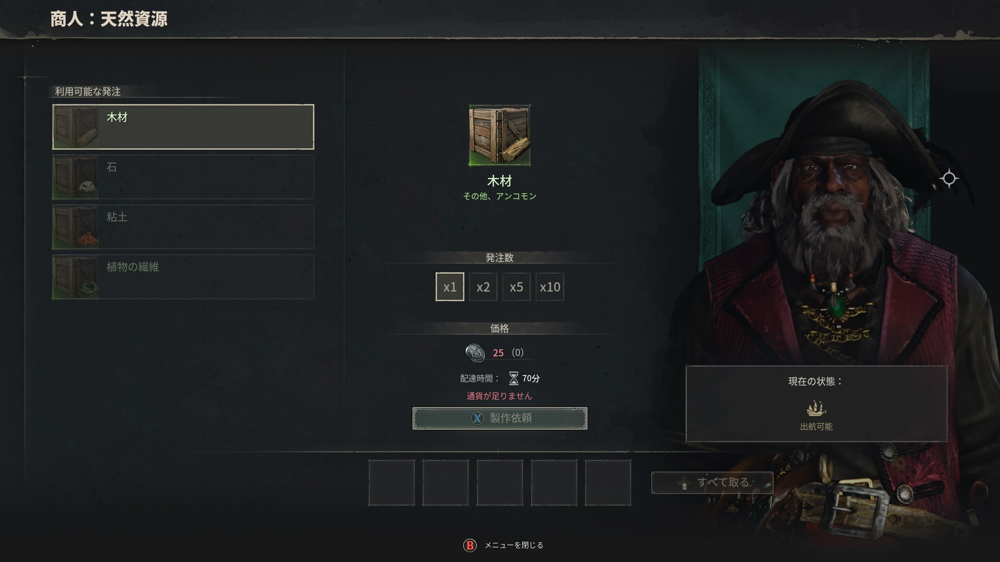

# 素材概要

> 情報源: [Steam ストアページ](https://store.steampowered.com/app/3041230/Windrose/) / [Steam コミュニティ ビギナーズガイド](https://steamcommunity.com/app/3041230/discussions/0/757304565299215807/)

## 素材カテゴリ

| ページ | 内容 |
|--------|------|
| [木材・石材](wood-stone.md) | 木材・石材の種類・採集場所・用途 |
| [鉱石・インゴット](ores-ingots.md) | 銅・タンバガなどの金属素材 |
| [植物・食材](plants-food.md) | ハーブ・食材の採集場所と用途 |

## 素材収集の基本

- 木材と石材は拠点建設の基本素材
- 鉱石は製錬炉（Smelting Furnace）でインゴットに加工
- 植物・食材は料理・錬金術に使用
- ヤシの木は食材源として保護推奨（切り倒さない）

