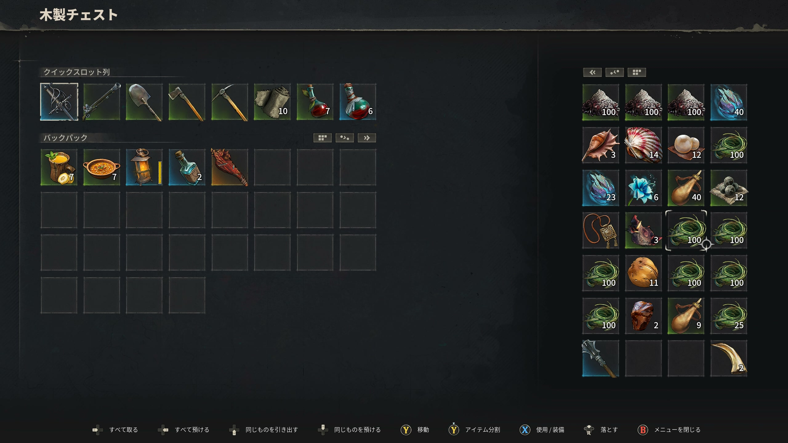
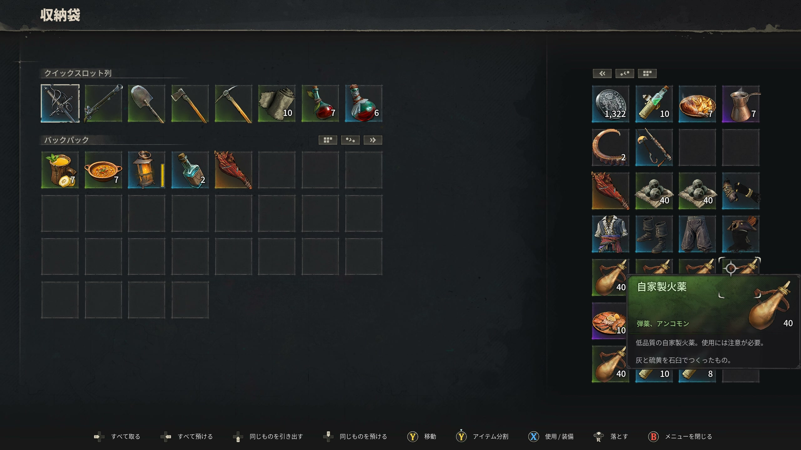
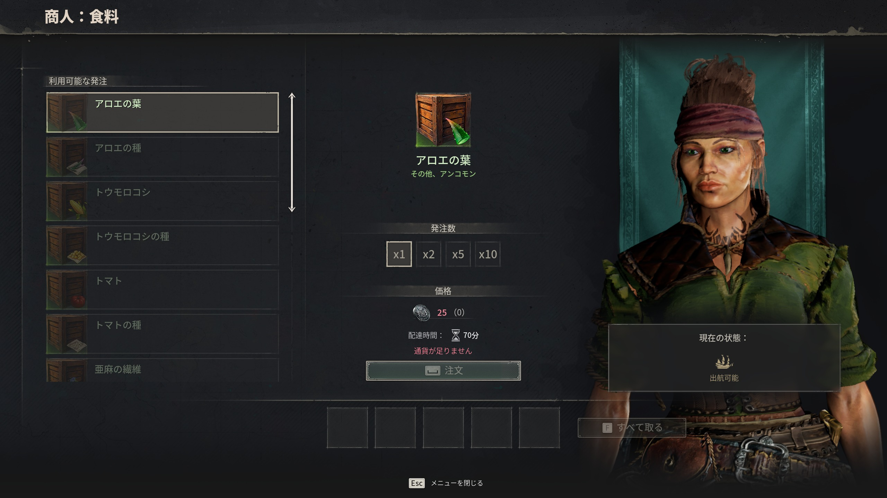

# 素材概要

> 情報源: [Steam ストアページ](https://store.steampowered.com/app/3041230/Windrose/) / [Steam コミュニティ ビギナーズガイド](https://steamcommunity.com/app/3041230/discussions/0/757304565299215807/)

## 素材カテゴリ

| ページ | 内容 |
|--------|------|
| [木材・石材](wood-stone.md) | 木材・石材の種類・採集場所・用途 |
| [鉱石・インゴット](ores-ingots.md) | 銅・タンバガなどの金属素材 |
| [植物・食材](plants-food.md) | ハーブ・食材の採集場所と用途 |

## 素材収集の基本

- 木材と石材は拠点建設の基本素材
- 鉱石は製錬炉（Smelting Furnace）でインゴットに加工
- 植物・食材は料理・錬金術に使用
- ヤシの木は食材源として保護推奨（切り倒さない）

## 商人から購入する

採集が間に合わない素材は **Tortuga・派閥アウトポストの商人**から購入できる。食料・果物・種・基本食材は「商人：食料」窓口で扱う。配送手間（時間）と価格 (Piastre) が表示される。

| 取扱例 | 価格目安 |
|-------|---------|
| アロエの葉 / トウモロコシの種 / トマトの種 | 25〜75 P |
| 果実類 | 50〜100 P |

> **Trader Contracts（商人契約）**を使えば拠点に商人を呼び出せる。詳細は [勢力・名声 → People of Tortuga](../factions.md#people-of-tortugaトルトゥーガの民) を参照。
