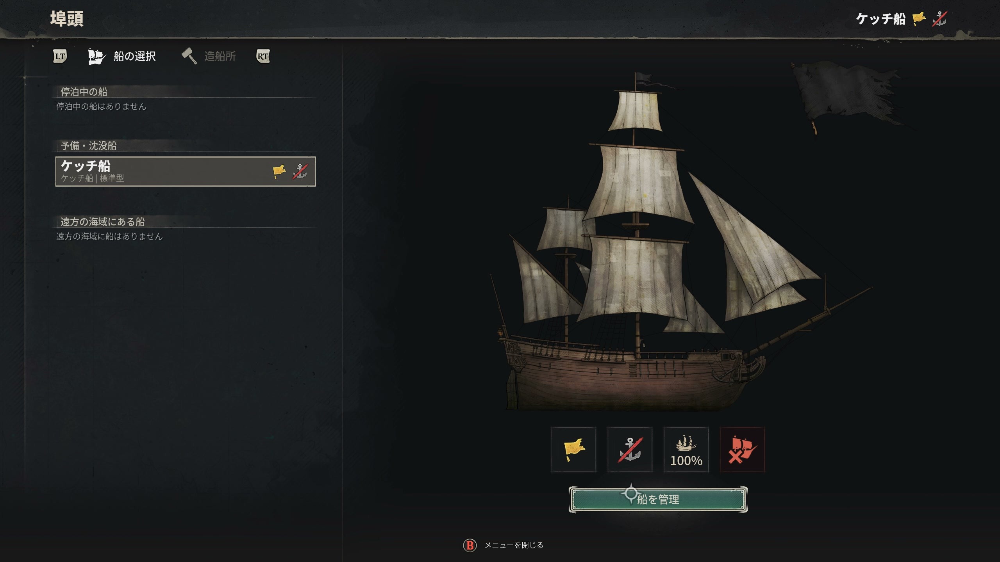
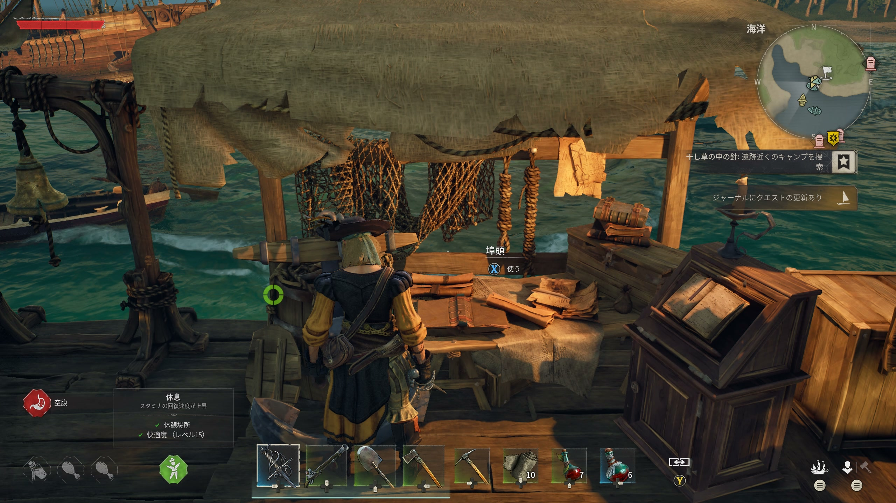

# 船概要

> 情報源: [Steam ストアページ](https://store.steampowered.com/app/3041230/Windrose/)

船はWindroseの探索と海戦において中心的な役割を果たします。3種類の船を操舵でき、それぞれ異なる特性を持ちます。陸地と海のシームレスな移動が可能で、島から島への移動は船で行います。

## 各サブページ

| ページ | 内容 |
|--------|------|
| [船の種類](ship-types.md) | ケッチ・ブリッグ・フリゲートの性能比較と用途 |
| [海戦ガイド](naval-combat.md) | 砲撃・乗り込み（ボーディング）の戦術解説 |
| [船カスタマイズ](customization.md) | 船の装備・外観・アップグレード方法 |

## 船入手の流れ

銅鉱石の採掘後、ゲーム内のNPC「Doctor」が最初のボートを提供してくれます。その後、ゲームの進行に合わせてより大きな船に乗り換えることができます。詳細は情報収集中。
