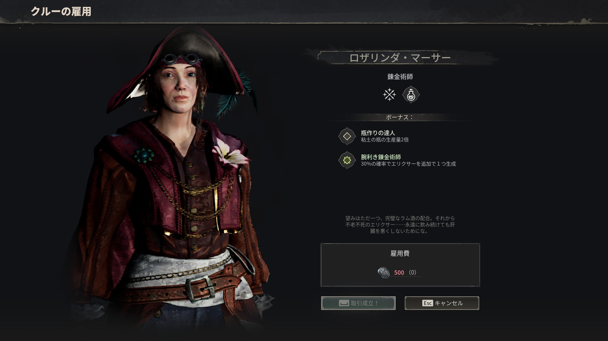
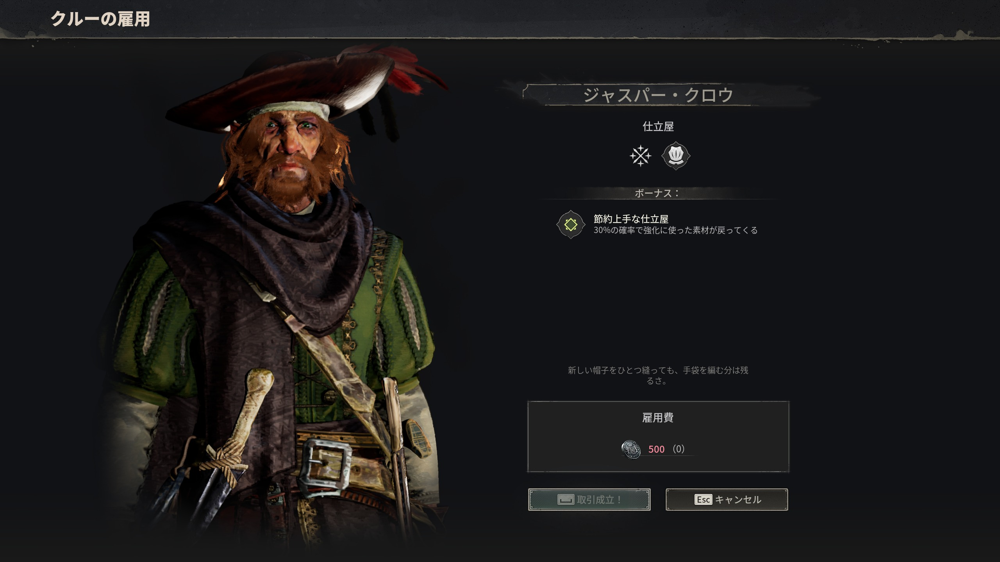

# クルー雇用

> 情報源: [Method.gg Factions and Reputations](https://www.method.gg/windrose/windrose-factions-reputations-all-faction-items-best-faction-order) / 各派閥拠点で観測 / コミュニティ（Steam Discussions）

Windrose では Tortuga および各派閥拠点で **NPC クルー**を有料雇用できる。雇用したクルーは:

- **拠点（Bonfire）に Settle** → ステーションのパフォーマンスを底上げするワーカー
- **船に乗船させて Ship Crew** → ボーディング戦闘に参加・船内ルーチン

の 2 系統で運用する。

## 雇用画面の見方

NPC に話しかけて「雇用」を選ぶと専用 UI が開く。左に NPC のポートレート、右に職種・ボーナス効果・雇用費（Piastre）が表示される。

| UI 要素 | 内容 |
|---------|------|
| 左ポートレート | NPC の立ち絵 |
| 名前・職種 | 例: ロザリンダ・マーサー / 鍛冶師 |
| ボーナス | 拠点配置時の効果（同職種でも差異あり） |
| 雇用費 | 一括 Piastre 支払い（例: 500P） |
| 「雇用する」ボタン | 確定。即時にパーティーに加入する |
| 「キャンセル」 | 雇用を取りやめる |

## 確認されている雇用可能 NPC

| NPC 名 | 職種 | 雇用費 | ボーナス効果 |
|--------|------|--------|------------|
| **Black Axel** | 料理係 | 500 P | 料理の産出 +30% |
| **Rosalinda Mercer**（ロザリンダ・マーサー） | 鍛冶師 | 500 P | Clay Bottle 産出倍化 + Elixir 追加産出 +30%（**2026-04-30 パッチで紫エリキサー30%チャンスのバグ修正**） |
| **Jasper Crowe**（ジャスパー・クロウ） | 仕立屋 | 500 P | アップグレード素材の返却 +30% |
| **Mortar Joe** | 火薬係 | 500 P（Brethren 拠点） | 火薬（Gunpowder）生産 +50% |
| **Doctor Galen** | 医師 | — | 毎時 Minor Healing Potion を1本無料配布（各 Bonfire ごとに独立タイマー） |
| **John Doe** | 研究員 | — | 研究（Research）機能を提供（Needle in a Haystack クエスト後に Settle すること） |

> 一部 NPC（Doctor Galen / John Doe）は通常の Piastre 雇用ではなくクエスト報酬として加入する。

## 雇用後の運用

### 拠点配置（Settle）

雇用した NPC は **拠点 Bonfire の「ワーカー」タブから手動でアサイン**しないとステーション効果が発動しない。配置だけでは稼働しない点に注意。

- **Settle のみ使う**（Evict は NPC 消失リスクあり）
- Settle 後は NPC が拠点内を自律的に歩き回る — **位置に関係なくステーション効果は発動済み**
- 1人の NPC は1つの拠点（Bonfire）に紐づく。別拠点で稼働させたい場合は再 Settle が必要

### 船配置（Ship Crew）

Ship Crew は **船内のクルー枠**にアサインする。

- ボーディング戦闘に参加（敵船襲撃時に同行）
- **Deckhand は船内ハンモックで睡眠**、昼夜のルーチン行動を持つ
- 修理クルーは戦闘中に船体修理を実行
- 一部ワーカーは継続コスト（給与）あり

詳細な戦闘運用は [海戦ガイド](naval-combat.md) を参照。

## 雇用 NPC の入手場所

| 入手場所 | 主な NPC |
|---------|---------|
| **Tortuga 都市内** | Black Axel / Jasper Crowe / Rosalinda Mercer 他 |
| **Brethren 拠点（沿岸の同胞）** | Mortar Joe |
| **クエスト報酬** | Doctor Galen（拠点系）/ John Doe（Needle in a Haystack 完了後） |

## 注意点

- **John Doe は Settle が必須**: クエスト完了後、自分の Bonfire で Settle を実行しないと研究機能が永続ロックされる。Evict は使わないこと（消失リスク）
- **NPC が拠点から消えた**場合は新しい Bonfire 近くで Settle を実行
- **Doctor Galen の無料ポーション**は Bonfire ごとに独立したタイマーで管理される
- **Crew は航海に同行しない**仕様（Ship Crew のみ船に乗る）— コラム [Crew（乗組員）は航海に同行しない](../column/crew-on-ship.md) も参照

## 関連ページ

- [勢力・名声](../factions.md)
- [海戦ガイド](naval-combat.md)
- [取り逃し注意集](../missable.md)
