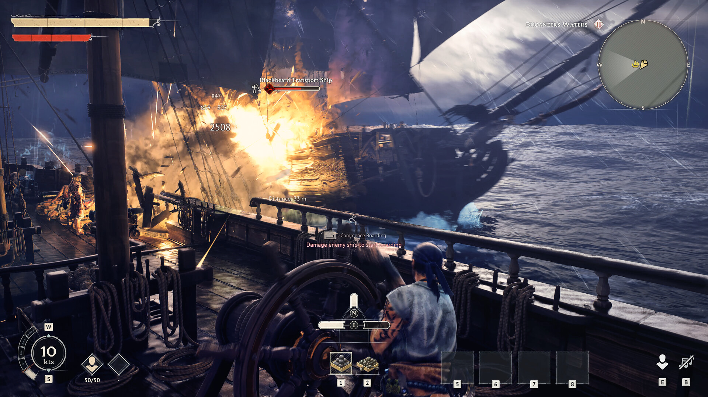

# 海戦ガイド

> 情報源: [Steam ストアページ](https://store.steampowered.com/app/3041230/Windrose/) / [windrosewiki.org 海戦ガイド](https://windrosewiki.org/blog/windrose-ship-building-guide-101) / [Boostmatch 船ガイド](https://boostmatch.gg/blog/windrose/articles/windrose-ship-building-guide-fix-frigate-cutter-alpha) / [allthings.how 大砲クラフトガイド](https://allthings.how/how-to-craft-cannons-and-complete-the-seafarer-quest-in-windrose/)

## 海戦の流れ（4フェーズ）

| フェーズ | 内容 |
|---------|------|
| **1. 砲撃戦** | 敵船との距離を保ちながら大砲で削り合う |
| **2. 機動** | Broadside（横撃ち）を維持しつつ旋回・距離調整 |
| **3. 接舷（Boarding）** | 敵船に乗り移り、甲板での近接戦へ移行 |
| **4. 上陸戦** | 敵の積み荷・船を奪取し戦闘終了 |

---

## 砲撃戦の基本戦術

### Broadside（ブロードサイド）を維持する

**Broadside = 船の側面を敵に向けて砲撃する体勢**。これが海戦の基本姿勢。

- 船の側面（左右）に大砲が並んでいるため、側面を敵に向けるほど多くの砲門が撃てる
- 正面や背面を向けると砲撃数が減る
- **両舷（左右交互）でサイクル射撃**することで攻撃の隙を最小化できる

### 砲撃の照準

- **本能より低く狙う** — 砲弾は放物線を描くため、センターマス（胴体中心）に合わせると上を飛び越える。やや下を狙うのが正解
- **高波に注意** — 自分と敵の間に大波があると弾を完全に遮断される（双方向）。波の動きを見てから発射する
- リロード残量は画面上の**白いゲージ**で確認できる

### 機動の基本

速度によって船の性質が大きく変わる：

| 速度 | 用途 |
|------|------|
| **全速（Full）** | 接近・逃走 |
| **3/4速** | **旋回・ブロードサイド維持に最適**（最速で旋回できる） |
| **1/4速** | 敵の後方へ滑り込む・無力化した敵船への接近 |

1. **3/4速に落として旋回**しながら Broadside を維持する
2. 敵の正面・後方に出てしまったら全速で位置を取り直す
3. 敵船を無力化したら1/4速で後方に回り込む（敵は後部砲なし）

---

## Boarding（乗り込み）

> 情報源: [Neonlightsmedia Naval Combat Guide](https://www.neonlightsmedia.com/blog/windrose-naval-combat-guide) / [Boostmatch](https://boostmatch.gg/blog/windrose/articles/)

### Boarding の発動条件: **Disabled 状態**

敵船のHPを**致命的に削ると Disabled 状態（停止＋砲撃停止）** になる。この状態で横付けすると Boarding が可能になる。

**操作**: `SPACE` キーで Boarding 開始 → 敵船に乗り込み、甲板上の敵と白兵戦

### ⚠️ Boarding Gear を Wharf で装備必須

Boarding には**専用装備（Boarding Gear）を Wharf で船に装着**する必要がある。装備していないと Boarding コマンド自体が発動しない。事前に船にセットしておくこと。

### 敵船クルーは「無限湧き」

- ボーディング中の敵乗員は**切ってもキリがない無限湧き**
- 長期戦は禁物 → **敵の船長（Captain）を素早く倒す**ことが最短攻略
- コミュニティで調整対象として議論されている仕様

### 敵船 Ketch の狭さ対策

**Ketch クラスの敵船は甲板が狭すぎて回避がほぼ不可能**。

- **Blunderbuss / Musket で壁際から射撃**する戦法が推奨
- 近接戦に引きずり込まれると全方位から被弾する

### 降伏と即時ルート

- 敵船長を倒すと**敵が降伏**
- 降伏後は**helm（舵輪）を取ると戦闘終了**
- 戦闘終了後に **3〜4個のアイテムを即時ルート可能** + 周辺の flotsam（漂流物）も回収

### Boarding vs 沈没

| 戦術 | メリット | デメリット |
|------|---------|-----------|
| **Boarding** | **圧倒的に多くの戦利品**（船内チェスト+乗員ドロップ+ルート+flotsam） | 時間がかかる・被弾リスク |
| 沈没 | 短時間で決着 | **flotsam のみで戦利品が少ない** |

ルート効率は Boarding が**大幅に有利**。積極的に狙う価値がある。

### Boarding のタイミング

- 敵艦隊と戦う場合は**最後の1隻だけ Boarding**
- 他の敵船を先に沈めて単騎にしてから乗り込む
- 敵の砲撃が残っている状態で横付けすると一方的に削られる

---

## Seafarer クエスト（初めての海戦）

初めて海戦に挑む「Seafarer（シーファラー）」クエストの手順:

| 手順 | 内容 |
|------|------|
| 1 | **Shipwright's Workshop（造船台）** を建設 |
| 2 | **12-Pounder Cannon（12ポンド砲）** を製作 |
| 3 | **Wharf（桟橋）** を建設・船に大砲を装備 |
| 4 | 敵艦隊を砲撃で撃沈 |

### 大砲のクラフトレシピ

| アイテム | 素材 | 施設 |
|---------|------|------|
| **12-Pounder Cannon** | Copper Ingot ×10・Wood ×10 | Shipwright's Workshop |

---

## Hull（船体）の種類

Wharf でカスタマイズできる船体パーツ。耐久性と戦闘スタイルによって選択する。

| Hull 名 | 特徴 |
|---------|------|
| **Keelhold Hull** | Combat Repair Kit の効果持続が大幅延長。被弾しても回復が減速するだけで停止しないため、事実上の継続回復になる |
| **Standfast Hull** | 被弾ごとにダメージ軽減が積層。最大 **+25% DR**（ダメージレジスト） |
| **Iron Resolve Hull** | HPが低いほどDRが増加。**瀕死時に最も強くなる**逆境型 |

> **序盤推奨**: Standfast Hull。積層 DR が安定して機能し、複数船との同時交戦でも粘れる。

---

## 船の修理

- 戦闘艦は戦闘でダメージを受けると壊れる
- **Wood ×20 で修理可能**（緊急時のために常備推奨）
- Wharf（桟橋）近くで修理を行う

### 修理キットの種類

| キット | レシピ | 効果 |
|--------|--------|------|
| **Repair Kit（通常）** | Wood ×10 | 継続回復（HoT）。ダメージを受けると中断 |
| **Combat Repair Kit** | Wooden Plank ×5 + Steel Nails ×1 + Rum Bottle ×1 | **10秒間で船体HP 30%回復**（戦闘中使用可） |

Combat Repair Kit は戦闘継続中でも効果が続くため、激戦時は優先的に使う。

### 沈没時の積み荷は保護される

船が撃沈されても、**カーゴホールドに積んでいた素材・アイテムは消えない**。Wharf で船を修復・復旧すると積み荷をそのまま取り出せる。高価な素材は個人インベントリに持たず Cargo に入れておくと安全。

---

## 嵐・天候・航行危険

> 情報源: [G-Portal Weather System Guide](https://www.g-portal.com/wiki/en/windrose-weather-system-storm-survival-guide/)

### Tropical Storm（熱帯暴風）

| 項目 | 仕様 |
|------|------|
| 速度 | **-50%** |
| 視界 | **-80%** |
| 持続時間 | **20〜40 分** |

- 嵐中はコンパスが狂う → **島・ミニマップで方角を維持**
- **嵐の「眼」に入ると一時的に平常化** → ショートカットとして活用可能
- **Ghost Ship / Sea Serpent のスポーン率上昇** → 戦闘準備必須
- 夜間は月とランタンで視界確保可能

### Maelstrom（超レア・巨大渦潮）

- 巨大な渦。**継続的に船体ダメージ**
- **回転と逆方向に操舵して脱出**
- **Maelstrom 外縁で Kraken が出現**する特殊エンカウントあり

## クルーの雇用（Tortuga）

| 項目 | 仕様 |
|------|------|
| 雇用場所 | Tortuga |
| 支払い | **Piastres** |
| 例 | Jasper Crowe 500P / Black Axel 500P |
| 種類 | Base Manager / Farming Contractor / Mining Contractor / **Ship Crew（ボーディング戦闘参加）** |

雇用したクルーはアウトポストに連れて戻り、任意のステーションに割り当てる。

- **Ship Crew はボーディング戦闘に参加**
- 一部ワーカーは継続コストあり
- **Deckhand は船内ハンモックで睡眠**、昼夜のルーチン行動を持つ

## Tortuga 派閥ベンダー（船関連）

Tortuga には3つの派閥ベンダーがあり、それぞれ異なる船関連アイテムを販売している。

| 派閥 | 取り扱いアイテム |
|------|----------------|
| **Rogue Buccaneers** | レアな大砲設計図 |
| **Smugglers** | Hull Bracing（船殻補強）設計図・Naval Tactics 書 |
| **Brethren of the Coast** | Brigantine・Frigate の設計図（評判条件あり） |

### Naval Tactics 書（Smugglers）

各500 Piastres、Smugglers Level 3 解放が必要。装備は1冊のみ。

| 書名 | 効果 |
|------|------|
| **Ship Shape** | 戦闘外で船体HPが継続回復（regen） |
| **Silence the Guns** | 近くの敵船の砲撃リロード速度を -20% |
| **Ambush** | 2分間無戦闘後の最初の砲撃ダメージ +130% |
| **No Quarter** | 近くの敵船を撃沈するたびに船体HP +30% 回復 |
| **Stretch The Supply** | 消耗品（修理キット等）の効果時間 +30% |

## 海戦での注意点

- **火薬と弾薬は有限**。無駄打ちしないよう砲撃タイミングを見極める
- スターター艇は **K キーでいつでも召喚可能・喪失なし**
- 戦闘艦は撃沈されうるため、重要な素材は陸の拠点に保管しておく
- **ボーディング優先**が戦利品効率で最適
- 嵐の兆候を見たら早めに陸や眼へ回避

→ 船の種類・建造レシピは[船の種類](ship-types.md)を参照
