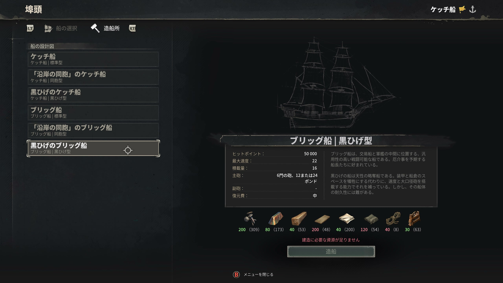

# 船の種類

> 情報源: [Steam ストアページ](https://store.steampowered.com/app/3041230/Windrose/) / [windrosewiki.org 船ガイド](https://windrosewiki.org/blog/windrose-ship-building-guide-101) / [Boostmatch 船ガイド](https://boostmatch.gg/blog/windrose/articles/windrose-ship-building-guide-fix-frigate-cutter-alpha)

## 船の2種類

Windroseの船は**スタータ艇**と**戦闘艦**に大別されます。

| 種別 | 特徴 | 破壊されるか |
|------|------|-----------|
| **スタータ艇（Ketch）** | 無料・召喚可能・永続 | **されない** |
| **戦闘艦（Brig / Frigate）** | Wharf で建造・高性能 | **される** |

---

## スタータ艇

### ケッチ（Ketch）— スターター

**クエスト「I Need a Bigger Boat」** クリアで入手。Doctor Galen から依頼される。

**取得条件:**
- **クルー7名を救出**する
- 修理素材を集める: Wood ×100・Nails ×20・Rope ×10・Coarse Fabric ×20

| 項目 | 内容 |
|------|------|
| サイズ | 小型 |
| 特徴 | **機動力最高**・軽量 |
| 召喚 | **K キーでいつでもどこからでも召喚可能** |
| 喪失 | **なし**（沈んでも戻ってくる） |
| 向いている場面 | 序盤探索・素早い移動・緊急脱出 |

スタータ艇は**最後まで使える移動手段**として機能する。

---

## 戦闘艦

Wharf（桟橋）で建造する本格的な海戦用の船。破壊された場合は再建造が必要。

### ブリッグ（Brig / Brigantine）

| 項目 | 内容 |
|------|------|
| サイズ | 中型 |
| 特徴 | 機動力と火力の**バランス型** |
| 向いている場面 | 汎用探索・中盤の海戦 |

### フリゲート（Frigate）

| 項目 | 内容 |
|------|------|
| サイズ | 大型 |
| 特徴 | **重火力・高耐久**の主力艦 |
| 向いている場面 | 強敵艦隊との海戦・後半コンテンツ |

---

## 船のバリエーションと性能差

各船種には**3つのバリエーション**があり、**性能に明確な違いがある**（外観のみではない）。

> 情報源: [Neonlightsmedia All Ships Best Variants](https://www.neonlightsmedia.com/blog/windrose-all-ships-best-variants)

### 船種別スペック表

| 船 | バリエーション | HP | 速度 | 大砲 |
|----|--------------|-----|------|------|
| **Ketch** | Stock | 50,000 | 19 kn | 3x 12-pdr |
| Ketch | Brethren | 65,000 | 17 kn | 3x 12-pdr |
| Ketch | Blackbeard | 35,000 | 21 kn | 3x 12/24-pdr |
| **Brigantine** | Stock | 70,000 | 20 kn | 6x 12-pdr |
| Brigantine | Brethren | 90,000 | 18 kn | 6x 12-pdr |
| Brigantine | Blackbeard | 50,000 | 22 kn | 6x 12/24-pdr |
| **Frigate** | Stock | 160,000 | 18 kn | 12x 24-pdr |
| Frigate | Brethren | 200,000 | 16 kn | 12x 24-pdr |
| Frigate | Blackbeard | 110,000 | 20 kn | 12x 24/36-pdr |

### バリエーションの性格

| バリエーション | 性格 | 向き |
|--------------|------|------|
| **Stock（標準）** | バランス型 | 汎用 |
| **Brethren（海賊同盟）** | **HP +30%、速度 -2kn** | 耐久重視・正面戦 |
| **Blackbeard（黒ひげ）** | **HP -30%、速度 +2kn、上位砲装備可** | 火力・機動重視、一撃離脱 |

### 設計図の解放

| 船 | 解放条件 | 価格 |
|----|---------|------|
| Ketch | "I Need a Bigger Boat" クエストで取得 | — |
| **Brigantine** | **Brethren of the Coast 評判 Lv2** → Tortuga で設計図購入 | 1,000 Piastre |
| **Frigate** | **Brethren of the Coast 評判 Lv4** → Tortuga で設計図購入 | **3,000 Piastre** |

Blackbeard バリエーションは Blackbeard 派閥の評判が必要（要検証）。

## 大砲の種類

| 大砲 | 装備可能な船 | ダメージ | リロード |
|------|-------------|---------|---------|
| **12-Pounder** | 全船種の Stock / Brethren（通常ルート） | — | — |
| **24-Pounder** | **Blackbeard Brigantine 以上 / Frigate 全バリエ** | — | — |
| **36-Pounder** | **Blackbeard Frigate 限定** | **2,500** | **約15秒** |
| Perfectly Ordered 12-Pounder | 特殊 | 特殊（4秒以内連続ヒットで22秒間リロード+30%） | — |

> Carronade / Long Cannon は開発予告（未実装）

### 砲弾種類

| 弾種 | 切替キー | 用途 |
|------|--------|------|
| 通常弾（Cannonball） | **1** | 船体ダメージ |
| 鎖弾（Chain Shot） | **2** | マスト・帆を破壊して敵船を減速 |

合計で45種類以上の船関連アイテム（帆・部品・大砲など）が実装されています。

> 情報源: [Windrose.tools アイテムDB](https://windrose.tools/items)（船カテゴリ45アイテム）

---

## 船の建造

### 必要施設

| 施設 | 素材 | 設置場所 |
|------|------|---------|
| **Wharf（桟橋）** | Wood ×10・Coarse Fabric ×10 | **水際（海岸線）** に設置 |

**Wharf アンロック前提クエスト（3本）**: 「Rescuing The Crew」→「I Need A Bigger Boat」→「How My Sea Adventure Began」（12-Pounder 砲のクラフトが必要）
| Shipwright's Workshop | 情報収集中 | 拠点 |

### 建造レシピ

| 船 | 素材 |
|----|------|
| **Sloop（スループ）** | Pinewood Plank ×30・Hemp Rope ×10・Iron Nail ×5・Canvas Cloth ×2 |
| **Ketch（戦闘型）** | Wood ×150・Nails ×100・Coarse Fabric ×40・Rope Fiber ×30 |
| Brig / Frigate | 情報収集中 |

---

## 船の修理コスト

> 情報源: [allthings.how Ship Repair](https://allthings.how/windrose-ship-repair-every-method-and-material-you-need/)

修理方法は複数あり、場所・状況で素材コストが大きく変わる：

| 方法 | 素材 | 備考 |
|------|------|------|
| **Wharf 修理** | **Wood のみ**（格安） | 港に戻れる時は最優先 |
| **現地修理** | Wood ×100 / Nails ×20 / Coarse Fabric ×20 / Rope ×10 | 遠征中用 |
| **Repair Kit**（航行中） | Wood ×10 | HoT（継続回復）。航海中の緊急修理 |
| **完全沈没時リスポーン** | Wood ×20 | **Wharf 必須** |

緊急用に Wood を常に船に積んでおくのが推奨。

### 沈没時の仕様

| 項目 | 仕様 |
|------|------|
| **Cargo Hold（船倉）の荷物** | **保持される** |
| **個人インベントリ** | **消失する**（死亡扱い） |
| 対処 | 沈み始めたらすぐ K キーでスタータ Ketch を呼んで脱出する |

## 予備船を片道ファストトラベル点として使う裏技

**Fast Travel Bell は最大10個**という上限があるが、**船を特定ポイントに放置すれば Bell 枠を消費せずに片道ファストトラベル点として機能する**。

- 探索したい遠方の島に予備船を係留
- 本拠点から K キーで船を呼び寄せられない距離でも、そこまで到達できる
- ただし「どこからでも召喚」機能とは干渉するので運用は要検討

---

## 船のカスタマイズ

Wharf で旗・帆・船体色のカスタマイズが可能。詳細は[船カスタマイズ](customization.md)を参照。

---

## 船選択のガイド

| 場面 | 推奨 |
|------|------|
| ゲーム開始直後 | **スタータ Ketch**（召喚可能・無料） |
| 中盤以降の探索 | **Brig**（バランス型） |
| 本格海戦 | **Frigate**（火力重視） |
| 緊急脱出 | **K キーでスタータ Ketch を召喚** |

→ 海戦の戦術は[海戦ガイド](naval-combat.md)を参照
