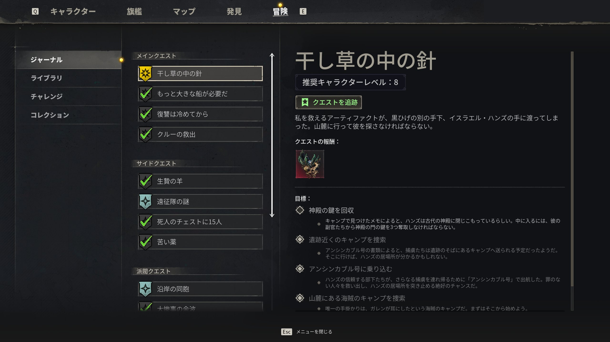

# メインストーリー

> 情報源: [Deltiasgaming Walkthroughs](https://deltiasgaming.com/) / [Destructoid Windrose](https://www.destructoid.com/) / [Method.gg](https://www.method.gg/) / [BisectHosting](https://www.bisecthosting.com/blog/windrose-thomas-richards-coastal-jungle-boss-location-tips-tricks-rewards) / [allthings.how](https://allthings.how/windrose-needle-in-a-haystack-quest-full-walkthrough/)

## ストーリーの概要

プレイヤーは謎の船長として、**黒ひげ（Blackbeard）**に挑む物語を歩みます。生存と復讐の個人的な物語が、帝国・海賊団・謎の暗黒勢力の三勢力による大きな争いへと発展していきます。

## Early Access 版のストーリー範囲

Early Access版（2026年4月14日開始）では **3バイオーム・2〜3体のメインボス** までのストーリーが収録されています。完全版は Early Access 期間中（約1.5〜2.5年）に順次追加されます。

## 序盤〜中盤のメインストーリーフロー

以下が現時点で判明している主要クエストの流れ：

### Coastal Jungle（Lv 1〜5 / 第1バイオーム）

| # | クエスト名 | 内容 |
|---|----------|------|
| 1 | **Islander（チュートリアル）** | 第1島到達、基本操作習得 |
| 2 | **ドクター・ガレン（Doctor Galen）召喚** | Bonfire を作成・対話で Galen を呼ぶ |
| 3 | **苦い薬（The Bitter Pill）** | Healing Herbs を Galen に渡して薬を調合してもらう。以降 Healing Potion を定期配布 |
| 4 | **Catastrophe's Aftermath** | 島の状況把握 |
| 5 | **How My Sea Adventure Began** | 冒険開始の前段 |
| 6 | **もっと大きな船が必要だ（I Need a Bigger Boat）** | **Copper 初採掘後** に Galen から発生。より大きな船の必要性 |
| 7 | **Seafarer** | **Ketch 取得チュートリアル**。Shipwright's Workshop → 12-Pounder Cannon → Wharf → 初海戦 |
| 8 | **復讐は冷めてから（Revenge is Best Served Cold）** | **Black Mark ×4 収集** → **Thomas Richards 戦**（Coastal Jungle ボス） |

勝利報酬: **Foothills 解放 + レベルキャップ上昇 + Iron 素材へのアクセス**

### Foothills（Lv 6〜10 / 第2バイオーム）

| # | クエスト名 | 内容 |
|---|----------|------|
| 9 | **干し草の中の針（Needle in a Haystack）** | Foothills の第2メインクエ。温泉・海戦・海賊キャンプ掃除 → Temple Keys 入手 → **イスラエル・ハンズ（Israel Hands）戦** |

> ジャーナルの「メインクエスト」タブから現在の目標を確認できる。クエストを「進行中」に設定するとマップ上に道標が表示される。

勝利報酬: **Charon's Obol（アーティファクト）** + **Soul Eater**（付近のチェスト）+ Cursed Swamps 進行解放

### Cursed Swamps（Lv 11〜15 / 第3バイオーム）

- 最終ボス: **Tainted Priestess（汚染された女祭司）**
- 敵: Plague Thrall, Plague Crocodile
- ハザード: 毒・疾病（ピンクに光るキノコ・森に触れると Plague 感染）
- 詳細攻略情報は現時点で限定的（Early Access の最終エリア）

## 詰まりやすい箇所

- **Median playtime 1.3時間** の壁（多くのプレイヤーが初期でリタイア）
- **ソロでの Thomas Richards 戦**（「ソロ不可能」と言うコミュ報告多数 → Rare装備・30分バフ・Bandage 10本で挑むのが最低限）
- **マルチプレイ参加時にサイレントに接続失敗**（シングルチュートリアル未完が原因）
- **Cloud Save のセーブデータ破損**（Cloud Save 無効化推奨）
- **Tortuga に買取 NPC がいないことに混乱**（売却は別 Trader へ）
- **Bonfire を撤去すると Galen が消える**（再建立で再召喚可）

## 経験値の稼ぎ方

- **クエスト完了** と **POI（ポイント・オブ・インタレスト）発見** が主な XP 源
- **敵討伐・クラフトは XP 付与なし**
- **POI 内の全チェストを開けないと XP が入らない**
- **Journal に記載されるサイドクエは XP 源として有用**
- 雑魚狩りでレベリングは非効率

## ドクター・ガレン（Doctor Galen）との関係

| 項目 | 内容 |
|------|------|
| 初回召喚 | **Bonfire 作成後に対話** |
| 定期配布 | **Healing Herbs を渡すと薬を調合**（ポーション入手） |
| 出発点 | 船・クエスト・ポーションの中心 NPC |
| 注意 | **Bonfire 撤去で消失**。拠点移動時は再建立で再召喚 |

## 関連ページ

- [サイドクエスト](side-quests.md)
- [勢力・名声](../factions.md)
- [ボス攻略](../enemies/bosses.md)
- [バイオーム](../exploration/biomes.md)
