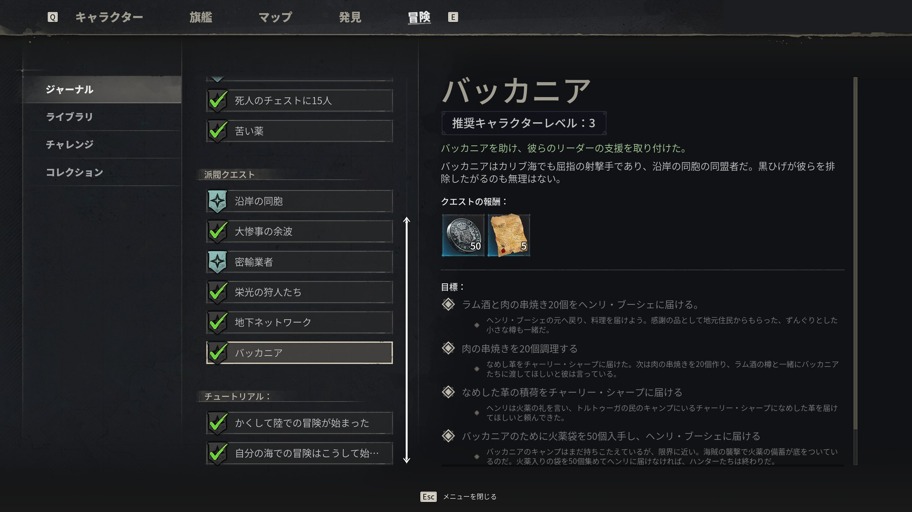
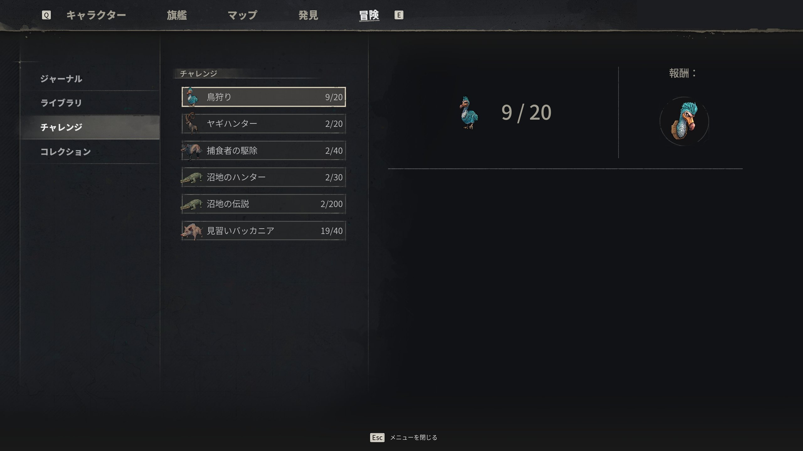

# サイドクエスト

> 情報源: [Steam ストアページ](https://store.steampowered.com/app/3041230/Windrose/)

## サイドクエストの概要

各勢力・NPCからサイドクエストを受注できます。名声の上昇・アイテム報酬・ストーリーの補完などが目的です。

ジャーナルは「メインクエスト / サイドクエスト / 週間クエスト」のタブに分かれており、それぞれに**推奨キャラクターレベル**と**クエスト報酬**が表示される。週間クエストは派閥に貢献するための定期繰り返しクエストで、上記スクショの「バッカニア」のように **ヘンリー・ブーシェ（Henry Bouché）**（沿岸の同胞派閥のリーダー）からの依頼が含まれる。

## サイドクエスト一覧

Early Accessリリース後に順次追記します。

現時点で確認されているサイドクエスト要素：
- 各バイオームに固有のクエストが存在
- 勢力（ファクション）別のクエストラインがある

---

## 確認済みサイドクエスト

### Underground Network（密輸業者解放）

> 情報源: [gamerblurb Smugglers](https://gamerblurb.com/articles/windrose-where-to-find-smugglers) / [FextraLife](https://windrose.wiki.fextralife.com/Smugglers)

**効果**: Tortuga 南東の洞窟にいる **Smugglers of Port Royal（密輸業者）** を解放。通常商人が買わない **Contraband / Luxuries / Ancient Items** を売却できるようになる（Piastre と Guinea の両通貨で買取）。

| 手順 | 内容 |
|------|------|
| 1 | 密輸業者のキャンプで **"Letter to a Good Friend"** を拾う |
| 2 | クエスト開始 → "Talk to Marita" |
| 3 | Tortuga 南東の洞窟 "Smugglers Waters" に侵入 |
| 4 | Marita と会話 → 隣の buyer NPC が解放 |

**報酬**: Ancient Items を高値（1〜5 Guinea）で換金可能、死蔵アイテムの整理。詳細は [勢力・名声 — 密輸業者](../factions.md#smugglers-of-port-royalポートロイヤルの密輸業者--事実上のブラックマーケット) を参照。

### Fifteen Men on a Dead Man's Chest（決闘セイバー入手）

Coastal Jungle 東端の **Pirate Remains 難破船**で Decrepit Chest を開けて Lamp・Blurry Sketch・**Dueling Saber**（Epic）を同時入手するとクエストが発火。詳細は [ユニーク装備](../equipment/uniques.md) を参照。

### Fate of the Prophets（Stargazer Tower）

> 情報源: [RespawnFirst Stargazer Tower Puzzle](https://respawnfirst.com/stargazer-tower-puzzle-solution-in-windrose/)

**場所**: Cursed Swamp バイオームの **Stargazer Tower**（3基）

| 手順 | 内容 |
|------|------|
| 1 | Stargazer Tower に到達し階段を下る |
| 2 | 鍵付きドア両側の石盤をカメラを上に向けて確認 |
| 3 | 隠しパネルの星座パターンに合わせてダイアルを回転させる |
| 4 | ドアが開いたら内部の Ancient Chest を回収（**Plague Thralls** に注意） |

**報酬**: 3基すべてクリアで **Tumbaga Ingot 合計 ×19**。装備昇格素材の確保として Cursed Swamp 進出後の優先クエスト。

### Glorious Hunters（Buccaneer's Friend 解放）

**Rogue Buccaneers** 派閥のクエストライン。最終報酬が Epic 遠距離武器 **Buccaneer's Friend**（刺突585, Precision Grade A）。同時に Rogue Buccaneers 名声 200 が必要。詳細調査中。

---

その他のクエスト（各派閥クエ・バウンティ等）は情報収集中です。

---

## チャレンジ（Challenges）

ジャーナルの「**チャレンジ**」タブはクエストではなく**累積実績型のグラインドコンテンツ**。特定の敵討伐数・素材入手数等を進めていくと報酬アイテムが解放される。

| 例 | 内容 | 報酬 |
|----|------|------|
| 鳥狩り | ドードー等の鳥型敵の討伐（9/20 等で進行表示） | 素材系報酬 |
| ヤギハンター | Mountain Goat の討伐（2/20） | 素材系 |
| 捕食者の駆除 | 肉食動物（Wolf 等）の討伐（2/40） | 素材系 |
| 沼地のハンター | Cursed Swamps の Crocodile 系討伐（2/30） | 素材系 |
| 沼地の伝説 | Cursed Swamps での累積討伐（2/200） | 高位報酬 |
| 見習いバッカニア | バッカニア系クエストの累積進行（19/40） | 名声・報酬 |

> チャレンジは**ストーリー進行と独立して常に進む**ため、普段プレイの副次報酬として機能する。サイドクエストや週間クエストと並行して埋まっていく。
